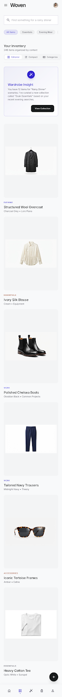
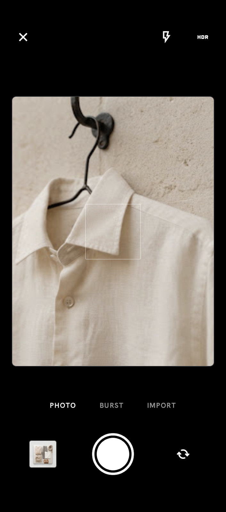
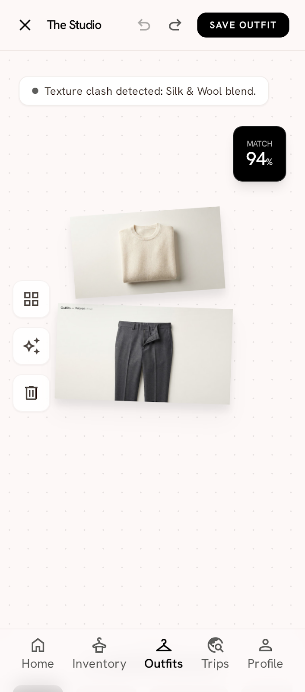
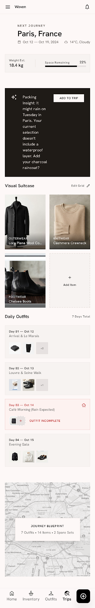

# Woven — armario digital con IA

Woven es una app móvil para digitalizar tu armario: fotografías tus prendas, la IA les quita el
fondo y sugiere categoría, color y temporada, y a partir de ahí creas outfits, planificas viajes
con la previsión del tiempo y descubres las prendas que llevas tiempo sin usar.

Proyecto personal full‑stack: producto, diseño, arquitectura, backend e IA, construido como un
monorepo TypeScript con **Expo / React Native** y **Supabase**.

|                                             Inventario                                              |                                              Captura                                               |                                         Outfits                                         |                                        Viajes                                        |
| :-------------------------------------------------------------------------------------------------: | :------------------------------------------------------------------------------------------------: | :-------------------------------------------------------------------------------------: | :----------------------------------------------------------------------------------: |
|  |  |  |  |

<sub>Mockups de diseño (`design/`); la app implementada sigue el Design System actual.</sub>

## Funcionalidades

- **Captura de prendas** con cámara o importación múltiple desde la galería. Las imágenes se
  redimensionan, recomprimen y pierden los metadatos EXIF (geolocalización) antes de subirse.
  Funciona **sin conexión**: la subida queda en cola y se completa al reconectar.
- **Recorte automático del fondo** (rembg autoalojado) para que cada prenda se vea sobre un fondo
  neutro uniforme.
- **Clasificación con IA** (Gemini, salida estructurada validada con Zod): sugiere categoría,
  color y temporada. Si la IA falla, el formulario manual sigue funcionando.
- **Inventario** con búsqueda, vista editorial/compacta, favoritos y listas virtualizadas.
- **Studio de outfits**: lienzo con arrastrar, escalar y rotar, y una **puntuación de combinación**
  generada por IA con sugerencias.
- **Viajes**: planificación por días con la previsión meteorológica (Open‑Meteo) y asignación de
  outfits a cada día.
- **Prendas olvidadas**: la home destaca lo que no te pones desde hace más de 60 días.
- **Perfil**: avatar, preferencias de estilo, tema claro/oscuro y borrado de cuenta completo
  (datos + ficheros).

## Stack

| Capa    | Tecnología                                                                               |
| ------- | ---------------------------------------------------------------------------------------- |
| Móvil   | Expo 57, React Native 0.86, React 19, Expo Router                                        |
| Estilos | NativeWind 4 + preset de Tailwind compartido (Design System propio)                      |
| Estado  | TanStack Query (servidor) · Zustand (UI efímera)                                         |
| Backend | Supabase: Postgres + Row Level Security, Storage privado, Edge Functions (Deno)          |
| IA      | Gemini (clasificación y outfits) · rembg (recorte) · Nomic Embed + pgvector (embeddings) |
| Calidad | TypeScript estricto, Zod en las fronteras, Vitest, pgTAP, Storybook, ESLint, Prettier    |
| Tooling | pnpm workspaces + Turborepo, GitHub Actions                                              |

## Arquitectura

```
apps/
  mobile/      App Expo (pantallas, navegación, integración nativa)
  web/         SPA Vite (esqueleto, pendiente)
packages/
  core/        Dominio puro: tipos y reglas, sin React ni Supabase
  api/         Cliente Supabase, tipos generados de la BD y llamadas a Edge Functions
  data/        Repositorios + hooks de TanStack Query (única vía de acceso a datos)
  store/       Estado de UI y colas offline (Zustand)
  ui/          Design System: átomos, moléculas y plantillas (Atomic Design) + Storybook
  config/      Preset de Tailwind, ESLint y TypeScript compartidos
supabase/
  migrations/  Esquema, RLS, RPCs y storage (migraciones forward‑only)
  functions/   Edge Functions: IA, subida firmada, clima, borrado de cuenta
  tests/       Tests pgTAP de aislamiento entre usuarios
```

Decisiones clave (documentadas como ADR en [`docs/ARCHITECTURE`](docs/ARCHITECTURE)):

- **Límites de dependencia forzados por lint**: `presentation → data (hooks) → core`. La UI nunca
  llama a Supabase directamente, y `packages/ui` no conoce la capa de datos.
- **Seguridad por defecto**: RLS en todas las tablas, bucket privado con URLs firmadas y
  aislamiento por carpeta de usuario. Todo lo que usa secretos o terceros vive en Edge Functions,
  nunca en el cliente.
- **Privacidad en la IA**: la foto original solo llega al servicio de recorte autoalojado; al
  proveedor externo solo se envía la prenda ya recortada.
- **IA intercambiable y tolerante a fallos**: proveedores detrás de una interfaz, prompts
  versionados, salidas validadas y _fallbacks_ para que un fallo de la IA nunca bloquee al usuario.
- **Design System con tokens** (color, espaciado, tipografía) como única fuente de verdad, con modo
  oscuro por tokens y un test que bloquea cambios no intencionados.

La especificación completa está en [`docs/`](docs): PRD, arquitectura técnica, plan de entrega y
guía de desarrollo.

## Puesta en marcha

Requisitos: Node ≥ 20, pnpm 9 y Docker (para Supabase local).

```bash
pnpm install
pnpm db:start                                  # Supabase local (Postgres, Auth, Storage)
cp apps/mobile/.env.example apps/mobile/.env   # rellenar URL y clave publishable
pnpm --filter mobile start                     # Expo
```

Las Edge Functions de IA necesitan sus propios secretos (ver
[`supabase/functions/.env.example`](supabase/functions/.env.example)). Sin ellos la app funciona
igual, con los campos rellenados a mano.

Comandos habituales:

```bash
pnpm lint && pnpm typecheck && pnpm test   # lo mismo que ejecuta el CI
pnpm --filter @woven/ui storybook          # catálogo del Design System
pnpm gen:types                             # regenerar tipos de la BD
```

## Estado

MVP funcional en móvil (Android). La app web está en esqueleto y la búsqueda semántica tiene el
backend listo (embeddings + pgvector) pero aún no tiene interfaz. El soporte multidioma está
pendiente de definir: la interfaz actual está en español.

## Autor

**Jorge Sánchez** — diseño, desarrollo y arquitectura.

© 2026 Jorge Sánchez. Todos los derechos reservados.
