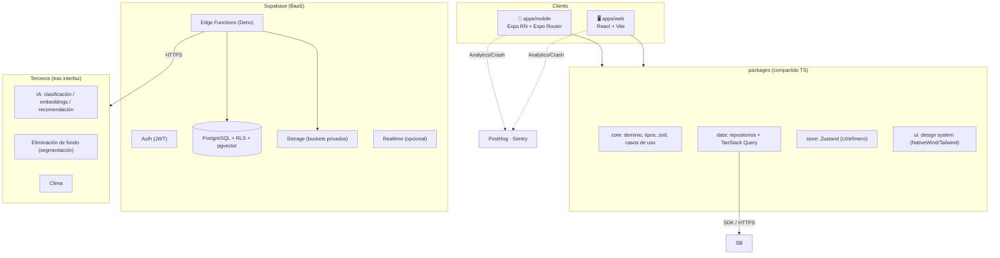
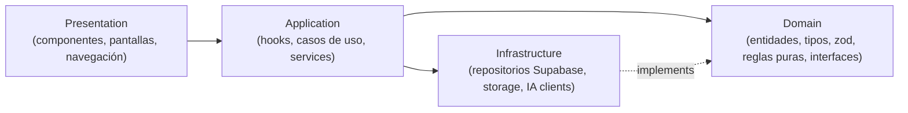
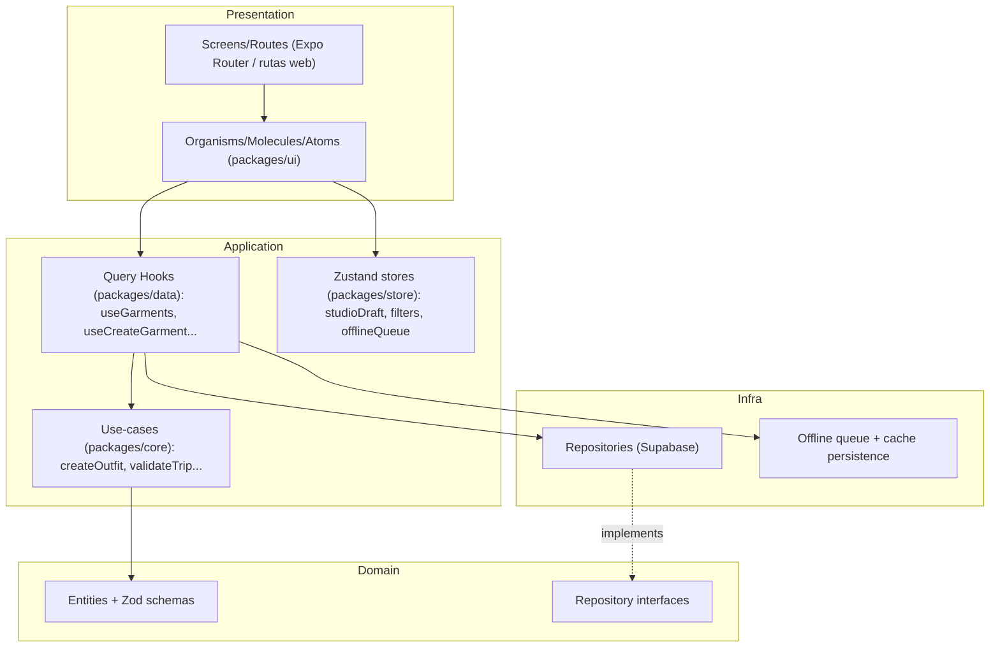
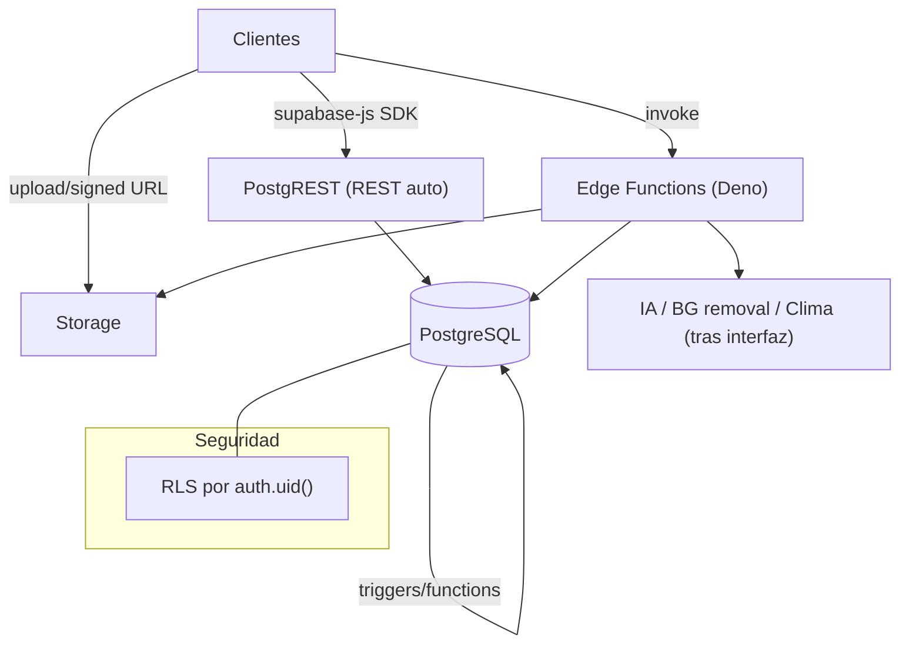
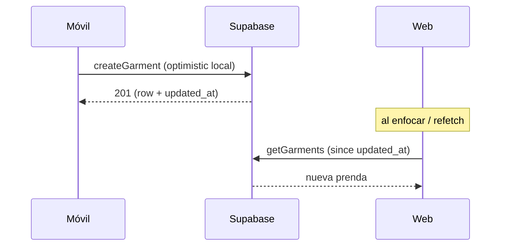

# 01 · Arquitectura general

## 1.1 Arquitectura de alto nivel

Woven es un sistema **cliente-servidor offline-first** con dos clientes (móvil y web) que comparten dominio, datos y estado, y un backend gestionado (Supabase) que concentra base de datos, autenticación, almacenamiento de imágenes y lógica de servidor (Edge Functions) que orquesta la IA y terceros.



**Decisiones ancla** (detalle y justificación en `02` y ADRs `12`):
- **BaaS (Supabase)** en lugar de backend propio: reduce superficie operativa (auth, DB, storage, funciones, RLS) para un equipo pequeño; Postgres estándar evita lock-in de datos.
- **La IA y todo tercero se orquestan en Edge Functions**, nunca desde el cliente: protege claves, centraliza rate-limits, permite cambiar de proveedor sin tocar clientes.

## 1.2 Arquitectura por capas

Cuatro capas con dependencia unidireccional (regla de oro, `00`).



| Capa | Responsabilidad | No debe |
|---|---|---|
| **Presentation** | Render, interacción, navegación. React/RN + design system. | Contener reglas de negocio ni llamadas directas a Supabase. |
| **Application** | Orquestación de casos de uso, hooks de datos (TanStack Query), estado de UI (Zustand). | Conocer detalles de SQL/tabla. |
| **Domain** (`packages/core`) | Entidades, tipos, validación (Zod), reglas puras (p. ej. "forgotten > 60 días", "TripDay dentro de rango"), **interfaces de repositorio/servicio**. | Importar React, Supabase, ni nada de infra. |
| **Infrastructure** (`packages/data`) | Implementaciones concretas: repositorios Supabase, cliente Storage, clientes IA/clima (a través de Edge Functions). | Filtrar tipos de Supabase hacia arriba sin mapear a dominio. |

Ventaja: el dominio es **testeable sin backend** y la infraestructura es **reemplazable** (p. ej., migrar de Supabase) sin tocar dominio ni presentación.

## 1.3 Arquitectura Frontend

Idéntica en móvil y web salvo la capa de presentación:



- **Presentación fina**: los componentes reciben datos ya moldeados por hooks; no arman queries.
- **Un hook por caso de uso de datos** (`useGarments`, `useCreateGarment`, `useOutfit`, …) — la pantalla no sabe si viene de red o caché.
- **NativeWind (móvil) + Tailwind (web)** comparten el **mismo preset de tokens** (`packages/config`), por lo que el design system es un único origen.

## 1.4 Arquitectura Backend

Supabase como plataforma; la lógica se reparte entre **Postgres (datos + reglas de integridad + RLS)** y **Edge Functions (orquestación de efectos)**.



Reparto de responsabilidad backend:
- **CRUD directo** de entidades del usuario → **PostgREST** (SDK) con **RLS** (sin backend intermedio; menos código, menos latencia).
- **Efectos con secretos o terceros** (recorte de fondo, clasificación, embeddings, recomendación, clima, procesado en lote) → **Edge Functions** (claves seguras, rate-limit, idempotencia).
- **Reglas de integridad** que deben cumplirse siempre (fechas de viaje, capas de outfit, `updated_at`) → **triggers/constraints** en Postgres (no confiables solo en cliente).

## 1.5 Comunicación entre módulos (dentro de un cliente)

- **Presentation ↔ Application**: por **hooks** (`useX`) y **stores** (Zustand selectors). Nunca imports cruzados de infra.
- **Application ↔ Domain**: llamadas a funciones puras y validación con esquemas Zod compartidos.
- **Application ↔ Infrastructure**: solo a través de **interfaces de repositorio** definidas en `domain`; la implementación concreta (Supabase) se inyecta.
- **Prohibido**: que un componente importe `supabase-js` directamente. Lint rule que lo bloquea (ADR-013).

```mermaid
flowchart LR
    Comp[Component] -->|useGarments()| Hook
    Hook -->|GarmentRepository| Iface[[interface]]
    Iface -.->|impl| SupaRepo[SupabaseGarmentRepository]
    Comp -->|useStudioDraft()| Zustand
```

## 1.6 Comunicación entre aplicaciones (mobile ↔ web ↔ backend)

- Móvil y web **no se comunican entre sí**; comparten estado a través del **backend** (fuente de verdad remota). La consistencia multi-dispositivo se logra por sincronización (offline `10`), no por canal directo.
- **Realtime (Supabase)**: opcional para MVP. Se puede activar para reflejar cambios entre dispositivos del mismo usuario (p. ej., prenda añadida en el móvil aparece en la web) — ADR-014 lo deja **desactivado por defecto** (polling/refetch en foco basta) y activable sin cambios de arquitectura.
- **Contratos compartidos**: tipos generados de la BD (`supabase gen types`) + esquemas Zod en `packages/core` garantizan que ambos clientes hablan el mismo lenguaje que el backend.


