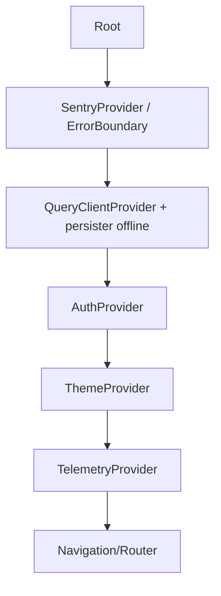
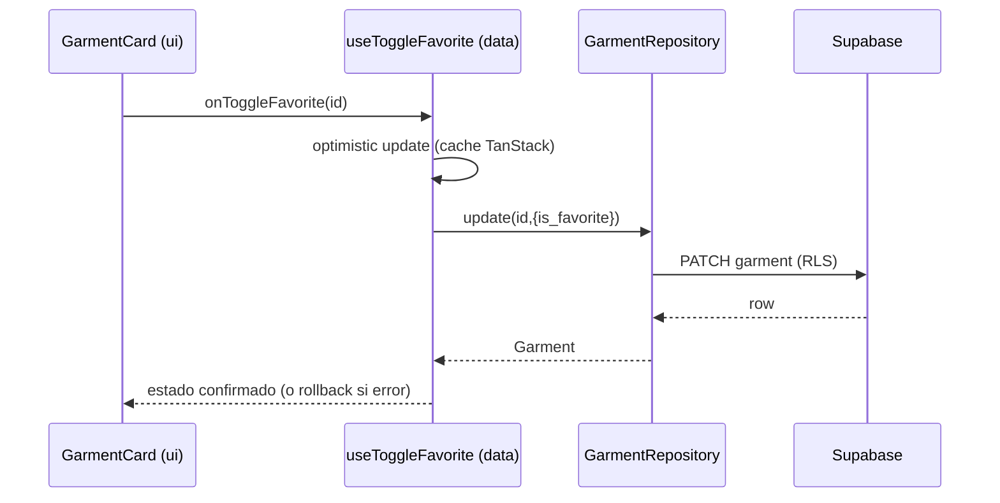

# 04 · Arquitectura de componentes

Separación por **responsabilidad** y **estabilidad de cambio**: lo reutilizable y estable vive en `packages/ui` (design system); lo específico de una feature vive junto a esa feature en la app.

## 4.1 Shared Components (`packages/ui`) — Atomic Design

Presentacionales, **sin lógica de datos**, reciben props tipadas. Reutilizables por móvil y web.

```
packages/ui/
├─ atoms/       Text, Button, IconButton, Icon, Chip, Input, Select,
│               ColorSwatch, Avatar, Badge, ProgressBar, Skeleton, Divider, Fab
├─ molecules/   SearchBar, CollectionChipRow, ViewModeToggle, GarmentCard,
│               TrayItem, AgendaItem, ForgottenPieceCard, DailyOutfitRow,
│               SuitcaseItem, SettingRow, StylePreferenceChip, StatCard,
│               WeatherPill, AiInsightBanner
├─ organisms/   BottomNavBar, TopNavBar, InventoryGrid, StudioCanvas, StudioTray,
│               CaptureCamera, CaptureReviewForm, TodaysLookHero, TripHeader,
│               DailyItinerary, AccountSettingsList, ProfileHeader
├─ templates/   TabScreenTemplate, FullScreenFlowTemplate, EditorTemplate,
│               EmptyStateTemplate, TwoColumnTemplate
└─ theme/       tokens (del preset), hooks de tema (useTheme)
```

**Regla:** un componente de `ui` **no** importa `data`/`store`. Si necesita datos, los recibe por props o callbacks. Esto los hace testeables en Storybook y con visual regression (§16).

## 4.2 Feature Components (en `apps/*`)

Componentes que **componen** organisms de `ui` con **hooks de datos** y estado. Viven por feature:

```
apps/mobile/app/(tabs)/inventory/
├─ InventoryScreen.tsx          # compone InventoryGrid + hooks
├─ components/
│  ├─ InventoryToolbar.tsx      # SearchBar + ViewModeToggle + CollectionChipRow conectados
│  └─ WardrobeInsightCard.tsx   # AiInsightBanner + acción
└─ hooks/useInventoryController.ts
```
- **Feature component = pegamento** entre design system y estado; es donde ocurre la orquestación de una pantalla.
- Justificación de la separación `ui` vs feature: el design system cambia poco y se comparte; la lógica de feature cambia a menudo y es específica de la app/plataforma. Mezclarlos rompería reutilización y tests visuales.

## 4.3 Hooks

Tres familias, en capas distintas:

| Familia | Ubicación | Ejemplos | Responsabilidad |
|---|---|---|---|
| **Query hooks** (datos) | `packages/data/queries` | `useGarments`, `useGarment`, `useCreateGarment`, `useOutfit`, `useSaveOutfit`, `useTrips`, `useCollections`, `useSemanticSearch` | Estado de servidor (TanStack Query): fetch, caché, mutaciones optimistas |
| **Domain/use-case hooks** | `packages/core` (funciones) + wrappers | `useForgottenPieces`, `useIsOutfitComplete` | Reglas puras aplicadas a datos ya cargados |
| **Controller/UI hooks** | `apps/*/.../hooks` | `useStudioController`, `useInventoryController`, `useCaptureFlow` | Orquestan estado de UI (Zustand) + query hooks + navegación |

Ejemplo de contrato (Query hook):
```ts
// packages/data/queries/useGarments.ts
export function useGarments(params: GarmentQuery) {
  return useQuery({
    queryKey: queryKeys.garments.list(params),
    queryFn: () => garmentRepository.list(params),
    staleTime: 60_000,
  });
}
```

## 4.4 Contexts

Uso **mínimo y estable** (Context re-renderiza a todos sus consumidores; solo para valores que cambian poco):
- `ThemeContext` (claro/oscuro/sistema) — `packages/ui`.
- `AuthContext` (sesión actual, usuario) — `apps/*` (envuelve Supabase Auth).
- `TelemetryContext` (PostHog/Sentry) — `packages/analytics`.
- **No** usar Context para datos de servidor (eso es TanStack Query) ni para estado de UI de alta frecuencia (eso es Zustand con selectors).

## 4.5 Providers

Orden de composición en la raíz de cada app (`_layout` móvil / `main` web):


- **QueryClientProvider** con persistencia (MMKV/AsyncStorage móvil; IndexedDB web) para offline.
- **ErrorBoundary** de Sentry envolviendo todo para capturar crashes de render.

## 4.6 Services (`packages/core/ports` + impl. en `data`/`api`)

Un **service** encapsula un efecto/dominio transversal tras una interfaz (testeable, sustituible):

| Service (interface en `core`) | Implementación | Uso |
|---|---|---|
| `AiService` | Edge Function client (`api/edge`) | clasificación, embeddings, recomendación, match score |
| `BackgroundRemovalService` | Edge Function client | recorte de fondo |
| `WeatherService` | Edge Function client | snapshots de clima |
| `ImageService` | `api` + Storage | compresión, subida, URLs firmadas, derivados |
| `Telemetry` | `packages/analytics` (PostHog+Sentry) | eventos, errores, métricas |
| `AuthService` | Supabase Auth wrapper | login/logout/sesión (UI `PD-01`) |

Justificación: la lógica de negocio depende de **interfaces**, no de proveedores concretos → cambiar OpenAI/clima/recorte no toca la app (ADR-007).

## 4.7 Repositories (`packages/core/ports` + impl. en `packages/data`)

Un **repository** abstrae el acceso a una entidad. La interfaz vive en `core`; la implementación Supabase en `data`.

```ts
// packages/core/ports/GarmentRepository.ts
export interface GarmentRepository {
  list(query: GarmentQuery): Promise<Garment[]>;
  getById(id: string): Promise<Garment | null>;
  create(input: NewGarment): Promise<Garment>;
  update(id: string, patch: GarmentPatch): Promise<Garment>;
  softDelete(id: string): Promise<void>;
  search(embeddingQuery: string): Promise<Garment[]>; // semántica
}
```
```ts
// packages/data/repositories/SupabaseGarmentRepository.ts
export const supabaseGarmentRepository: GarmentRepository = { /* usa supabase-js + mapea a dominio */ };
```

Repositorios previstos: `GarmentRepository`, `OutfitRepository`, `TripRepository`, `CollectionRepository`, `ProfileRepository`, `StylePreferenceRepository`, `AiRecommendationRepository`, `ImageRepository`.

**Por qué repositorios:** (1) los query hooks dependen de la interfaz, no de Supabase → tests con repos falsos; (2) el mapeo BD→dominio ocurre en un único sitio (no se filtran tipos de Supabase a la UI); (3) permite migrar backend sin tocar dominio ni presentación.

## 4.8 Flujo completo de una interacción (ejemplo: favoritar prenda)


