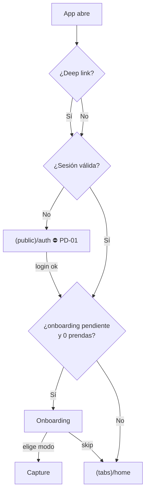

# 05 · Navegación

Motor único: **Expo Router** (file-based) en móvil y web. La estructura de rutas es común; los layouts divergen (bottom nav móvil / top nav web).

## 5.1 Árbol de rutas (Expo Router)

```
apps/mobile/app/
├─ _layout.tsx                # Root: providers (04.5) + gate de auth
├─ (public)/                  # navegación PÚBLICA (sin sesión) ⛔ PD-01 UI
│  └─ auth/                   # login/signup/reset (bloqueado por PD-01)
├─ (onboarding)/
│  └─ index.tsx               # Onboarding (sin nav bar)
├─ (tabs)/                    # navegación AUTENTICADA (5 destinos)
│  ├─ _layout.tsx             # Tabs layout (bottom nav móvil / top nav web)
│  ├─ home/index.tsx
│  ├─ inventory/
│  │  ├─ index.tsx
│  │  └─ [garmentId].tsx      # detalle de prenda
│  ├─ outfits/
│  │  ├─ index.tsx            # Studio (editor)
│  │  └─ [outfitId].tsx       # editar outfit existente
│  ├─ trips/
│  │  ├─ index.tsx            # lista/estado próximo
│  │  └─ [tripId].tsx         # detalle de viaje
│  └─ profile/
│     ├─ index.tsx
│     └─ settings/[section].tsx
└─ capture/
   └─ index.tsx               # Full-screen (modal), sin tab bar; ?mode=photo|burst|import
```

## 5.2 Layouts

| Layout | Ámbito | Comportamiento |
|---|---|---|
| Root `_layout` | Toda la app | Providers (Sentry→Query→Auth→Theme→Telemetry), **gate de auth**, splash, deep-link handling |
| `(tabs)/_layout` | Área autenticada | Renderiza `BottomNavBar` (móvil / vertical estrecho) o `TopNavBar` (web / ancho ≥ breakpoint tablet). Preserva estado por tab |
| `(onboarding)` | Primer uso | Sin nav; salida a `capture` o `(tabs)/home` |
| `capture` | Flujo enfocado | Presentación **modal full-screen**; suprime tab bar; cierre → vuelve al origen |
| `outfits/index` (Studio) | Editor | Cabecera propia (close, undo/redo, Save); tab activo = Outfits |

Preservación de estado: cada tab mantiene su pila (scroll de Inventory, filtros, borrador del Studio en Zustand) al cambiar de tab (§6).

## 5.3 Deep links / esquema de URLs

Compartido móvil (scheme `woven://`) y web (`https://app.woven.…/`):

| Ruta | Destino |
|---|---|
| `/home` | Home |
| `/inventory` | Inventario |
| `/inventory/:garmentId` | Detalle de prenda |
| `/outfits` | Studio (nuevo) |
| `/outfits/:outfitId` | Editar outfit |
| `/trips` · `/trips/:tripId` | Viajes / detalle |
| `/profile` · `/profile/settings/:section` | Perfil / ajuste |
| `/capture?mode=photo\|burst\|import` | Captura en modo |
| `/onboarding` | Onboarding |
| `/auth/*` | ⛔ **PD-01** |

Reglas: los deep links a rutas autenticadas pasan por el **gate de auth** (si no hay sesión → guardar `redirectTo` y enviar a auth). Nunca poner datos personales en query params (§13).

## 5.4 Navegación autenticada vs pública


- **Gate de auth** en Root `_layout`: lee sesión de `AuthContext` (Supabase). Sin sesión → grupo `(public)`. Con sesión → `(onboarding)` o `(tabs)`.
- El estado `has_completed_onboarding` decide entre onboarding y tabs.

## 5.5 Mobile

- **Bottom Navigation** persistente (5 destinos, icono+etiqueta), estado activo relleno/primario.
- FAB "add" en Home e Inventory → `capture`.
- Captura/Onboarding: full-screen sin tab bar.
- Gestos: swipe/scroll; drag táctil en Studio (`react-native-gesture-handler`).

## 5.6 Web

- **Top Navigation** con wordmark + enlaces + avatar; contenido centrado con `max-width` (editorial).
- Sin bottom nav (oculta ≥ breakpoint). Rutas = URLs reales (compartibles, back/forward del navegador).
- Studio con paleta lateral + bandeja inferior; DnD con puntero.

## 5.7 Tablet

- **Responsive por ancho** (no por SO): a partir del breakpoint tablet (propuesto **≥768px de ancho**, ⛔ **PD** confirmar) se usa **top nav** y rejillas con más columnas (Inventory Editorial 2–4, Compact hasta 8; Home/Trips bento multi-col).
- En vertical estrecho, tablet cae al patrón móvil (bottom nav).
- Studio en tablet: lienzo amplio + bandeja (ideal para drag).

## 5.8 Transiciones y back

- Entradas de página 300ms ease-in-out (design system).
- Back en Captura/Studio: confirma descarte si hay cambios sin guardar (borrador del Studio en Zustand permite recuperar).
