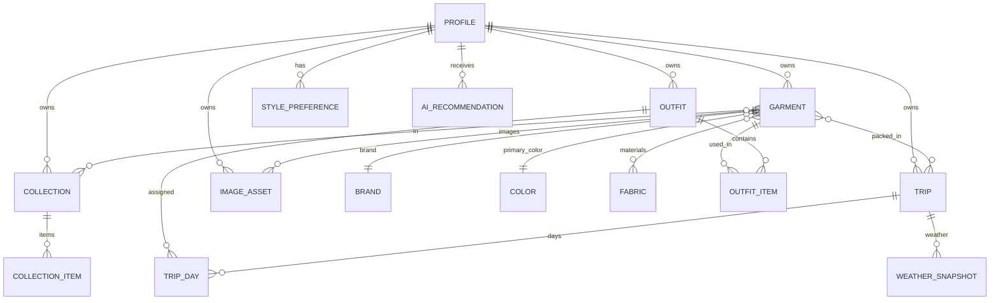

# 07 · Modelo de datos y Base de datos (PostgreSQL)

Base: PRD §7. Aquí se detalla el esquema físico ejecutable. Convenciones: `uuid` PK (`gen_random_uuid()`), `snake_case`, `timestamptz`, `user_id` en toda entidad de usuario, soft-delete con `deleted_at` donde aplica, RLS obligatoria.

## 7.1 Diagrama ER



## 7.2 Tipos enumerados

```sql
create type garment_status as enum ('processing','active','archived');
create type season as enum ('spring','summer','fall','winter');
create type image_type as enum ('original','processed','avatar','outfit_cover');
create type trip_status as enum ('upcoming','active','past');
create type ai_reco_type as enum
  ('outfit_suggestion','forgotten_piece','packing_insight',
   'wardrobe_insight','wardrobe_whisper','texture_clash','nudge');
create type ai_reco_status as enum ('active','dismissed','applied');
create type theme_pref as enum ('light','dark','system');
create type units_pref as enum ('metric','imperial');
create type view_density as enum ('editorial','compact','categories');
```
> `category` se modela como **tabla de referencia** (jerarquía y consolidación pendientes, PRD `PD-13`) en lugar de enum, para poder evolucionar sin migración de tipo.

## 7.3 DDL — Tablas de referencia

```sql
create table brand (
  id uuid primary key default gen_random_uuid(),
  name text not null,
  is_global boolean not null default false,   -- catálogo curado vs libre (PD)
  user_id uuid references profile(id) on delete cascade, -- null si global
  unique (coalesce(user_id::text,'global'), lower(name))
);

create table color (
  id uuid primary key default gen_random_uuid(),
  name text not null,
  hex text not null check (hex ~ '^#[0-9a-fA-F]{6}$')
);

create table fabric (
  id uuid primary key default gen_random_uuid(),
  name text not null unique
);

create table category (
  id uuid primary key default gen_random_uuid(),
  name text not null,
  parent_id uuid references category(id),      -- jerarquía (PD-13)
  sort int not null default 0
);
```

## 7.4 DDL — Perfil e imágenes

```sql
create table profile (
  id uuid primary key references auth.users(id) on delete cascade,
  display_name text,
  email text unique,
  avatar_asset_id uuid,                          -- FK diferida a image_asset
  has_completed_onboarding boolean not null default false,
  view_density_pref view_density not null default 'editorial',
  theme_pref theme_pref not null default 'system',
  units_pref units_pref not null default 'metric',
  language text not null default 'en-GB',
  created_at timestamptz not null default now(),
  updated_at timestamptz not null default now()
);

create table image_asset (
  id uuid primary key default gen_random_uuid(),
  user_id uuid not null references profile(id) on delete cascade,
  storage_path text not null,                    -- bucket/key privado
  type image_type not null,
  width int, height int,
  mime text, bytes int,
  created_at timestamptz not null default now()
);

alter table profile
  add constraint profile_avatar_fk
  foreign key (avatar_asset_id) references image_asset(id) on delete set null;
```

## 7.5 DDL — Garment y relaciones

```sql
create table garment (
  id uuid primary key default gen_random_uuid(),
  user_id uuid not null references profile(id) on delete cascade,
  name text not null,
  category_id uuid not null references category(id),
  brand_id uuid references brand(id) on delete set null,
  primary_color_id uuid not null references color(id),
  season season,
  style text[] not null default '{}',
  original_image_id uuid references image_asset(id) on delete set null,
  processed_image_id uuid references image_asset(id) on delete set null,
  is_favorite boolean not null default false,
  status garment_status not null default 'processing',
  last_worn_at timestamptz,
  purchase_price numeric(10,2),                  -- PD-07
  embedding vector(1536),                        -- pgvector (dim segun modelo, PD-05)
  deleted_at timestamptz,
  created_at timestamptz not null default now(),
  updated_at timestamptz not null default now()
);

create table garment_fabric (
  garment_id uuid not null references garment(id) on delete cascade,
  fabric_id uuid not null references fabric(id) on delete cascade,
  primary key (garment_id, fabric_id)
);
```

## 7.6 DDL — Outfits

```sql
create table outfit (
  id uuid primary key default gen_random_uuid(),
  user_id uuid not null references profile(id) on delete cascade,
  name text,
  match_score int check (match_score between 0 and 100),
  occasion text,
  cover_image_id uuid references image_asset(id) on delete set null,
  created_at timestamptz not null default now(),
  updated_at timestamptz not null default now()
);

create table outfit_item (
  id uuid primary key default gen_random_uuid(),
  outfit_id uuid not null references outfit(id) on delete cascade,
  garment_id uuid not null references garment(id),   -- no cascade: soft-delete de garment
  pos_x numeric not null default 0,
  pos_y numeric not null default 0,
  z_index int not null default 0,
  rotation numeric not null default 0,
  scale numeric not null default 1,
  unique (outfit_id, z_index)                        -- capas únicas por outfit
);
```

## 7.7 DDL — Trips

```sql
create table trip (
  id uuid primary key default gen_random_uuid(),
  user_id uuid not null references profile(id) on delete cascade,
  destination text not null,
  start_date date not null,
  end_date date not null,
  status trip_status not null default 'upcoming',
  -- weight_est_kg / space_remaining_pct: PD-09 (no calcular)
  created_at timestamptz not null default now(),
  updated_at timestamptz not null default now(),
  check (start_date <= end_date)
);

create table trip_day (
  id uuid primary key default gen_random_uuid(),
  trip_id uuid not null references trip(id) on delete cascade,
  date date not null,
  outfit_id uuid references outfit(id) on delete set null,  -- 1 por día
  is_outfit_complete boolean not null default false,        -- derivado
  label text,
  unique (trip_id, date)
);

create table trip_garment (
  trip_id uuid not null references trip(id) on delete cascade,
  garment_id uuid not null references garment(id),
  primary key (trip_id, garment_id)
);

create table weather_snapshot (
  id uuid primary key default gen_random_uuid(),
  trip_id uuid references trip(id) on delete cascade,
  date date not null,
  temp_c numeric, condition text, location text,
  fetched_at timestamptz not null default now()
);
```

## 7.8 DDL — Collections, preferencias, recomendaciones

```sql
create table collection (
  id uuid primary key default gen_random_uuid(),
  user_id uuid not null references profile(id) on delete cascade,
  name text not null,
  is_ai_generated boolean not null default false,
  created_at timestamptz not null default now(),
  updated_at timestamptz not null default now()
);

create table collection_item (
  collection_id uuid not null references collection(id) on delete cascade,
  garment_id uuid not null references garment(id) on delete cascade,
  primary key (collection_id, garment_id)
);

create table style_preference (
  id uuid primary key default gen_random_uuid(),
  user_id uuid not null references profile(id) on delete cascade,
  tag text not null,
  unique (user_id, lower(tag))
);

create table ai_recommendation (
  id uuid primary key default gen_random_uuid(),
  user_id uuid not null references profile(id) on delete cascade,
  type ai_reco_type not null,
  context jsonb not null default '{}',
  garment_id uuid references garment(id) on delete cascade,
  outfit_id uuid references outfit(id) on delete cascade,
  trip_id uuid references trip(id) on delete cascade,
  message text,
  status ai_reco_status not null default 'active',
  created_at timestamptz not null default now()
);
```

## 7.9 Índices

```sql
-- listados por usuario (patrón dominante)
create index idx_garment_user      on garment(user_id) where deleted_at is null;
create index idx_garment_favorite  on garment(user_id, is_favorite) where deleted_at is null;
create index idx_garment_status    on garment(user_id, status);
create index idx_garment_lastworn  on garment(user_id, last_worn_at);   -- Forgotten Pieces
create index idx_outfit_user       on outfit(user_id);
create index idx_trip_user_status  on trip(user_id, status, start_date);
create index idx_collection_user   on collection(user_id);
create index idx_aireco_user_status on ai_recommendation(user_id, status, created_at desc);
create index idx_tripday_trip      on trip_day(trip_id, date);
create index idx_image_user_type   on image_asset(user_id, type);

-- M:N joins
create index idx_outfititem_garment on outfit_item(garment_id);
create index idx_collitem_garment   on collection_item(garment_id);
create index idx_garmentfabric_fab  on garment_fabric(fabric_id);

-- búsqueda semántica (pgvector, ivfflat o hnsw segun versión)
create index idx_garment_embedding on garment using hnsw (embedding vector_cosine_ops);
```

## 7.10 RLS (obligatoria en todas las tablas de usuario)

```sql
-- patrón para tablas con user_id directo
alter table garment enable row level security;
create policy garment_rw on garment
  using (user_id = auth.uid())
  with check (user_id = auth.uid());
-- idéntico para: profile(id=auth.uid()), outfit, trip, trip_day(via trip),
-- collection, style_preference, ai_recommendation, image_asset, weather_snapshot(via trip)

-- tablas hijas sin user_id: RLS por join al padre
alter table outfit_item enable row level security;
create policy outfit_item_rw on outfit_item
  using (exists (select 1 from outfit o where o.id = outfit_id and o.user_id = auth.uid()))
  with check (exists (select 1 from outfit o where o.id = outfit_id and o.user_id = auth.uid()));
-- análogo: collection_item(via collection), garment_fabric(via garment), trip_garment(via trip)

-- tablas de referencia globales: lectura pública autenticada, escritura solo service_role
alter table color enable row level security;
create policy color_read on color for select using (auth.role() = 'authenticated');
-- fabric, season(enum), category, brand(is_global) igual; brand de usuario via user_id
```
Storage: buckets **privados**; políticas por path `user_id/...`; acceso solo con **URLs firmadas** (§13).

## 7.11 Triggers y funciones

```sql
-- 1) updated_at automático
create or replace function set_updated_at() returns trigger as $$
begin new.updated_at = now(); return new; end $$ language plpgsql;
create trigger trg_garment_updated before update on garment
  for each row execute function set_updated_at();
-- (repetir en profile, outfit, trip, collection)

-- 2) crear filas de perfil al registrarse (Supabase Auth)
create or replace function handle_new_user() returns trigger as $$
begin
  insert into profile (id, email) values (new.id, new.email);
  return new;
end $$ language plpgsql security definer;
create trigger on_auth_user_created after insert on auth.users
  for each row execute function handle_new_user();

-- 3) trip_day.date dentro del rango del viaje
create or replace function check_trip_day_range() returns trigger as $$
declare s date; e date;
begin
  select start_date, end_date into s, e from trip where id = new.trip_id;
  if new.date < s or new.date > e then
    raise exception 'trip_day.date % fuera del rango del viaje', new.date;
  end if;
  return new;
end $$ language plpgsql;
create trigger trg_tripday_range before insert or update on trip_day
  for each row execute function check_trip_day_range();

-- 4) búsqueda semántica RPC (usada por el repositorio, ver 08)
create or replace function search_garments(query_embedding vector(1536), match_count int)
returns setof garment as $$
  select * from garment
  where user_id = auth.uid() and deleted_at is null and embedding is not null
  order by embedding <=> query_embedding
  limit match_count;
$$ language sql stable;

-- 5) soft-delete seguro de garment (marca deleted_at; conserva referencias en outfits/trips)
create or replace function soft_delete_garment(g uuid) returns void as $$
  update garment set deleted_at = now(), status='archived'
  where id = g and user_id = auth.uid();
$$ language sql;
```

## 7.12 Migraciones

- **Herramienta:** Supabase CLI (`supabase/migrations/*.sql`), versionadas y en Git; aplicadas en CI a staging y prod.
- **Convención:** una migración por cambio atómico; nunca editar una migración ya aplicada (crear una nueva).
- **Tipos generados:** tras cada migración, `supabase gen types typescript` → `packages/api/generated`. CI falla si los tipos generados difieren de los commiteados (contrato).
- **Orden inicial:** `0001_extensions.sql` (`create extension pgvector; pgcrypto`), `0002_enums.sql`, `0003_reference.sql`, `0004_profile_images.sql`, `0005_garment.sql`, `0006_outfit.sql`, `0007_trip.sql`, `0008_collection_prefs_ai.sql`, `0009_indexes.sql`, `0010_rls.sql`, `0011_functions_triggers.sql`.

## 7.13 Seeds

- **Referencia (idempotente):** `fabric` (Linen, Wool, Cashmere, Silk, Cotton, Denim, Leather), `color` (con hex de swatches del diseño), `category` (taxonomía inicial — sujeta a `PD-13`), `brand` globales opcionales.
- **Dev/demo:** un usuario de prueba con prendas de ejemplo para desarrollo local y E2E (no en prod).
- Seeds en `supabase/seed/*.sql`, ejecutados solo en dev/staging.
