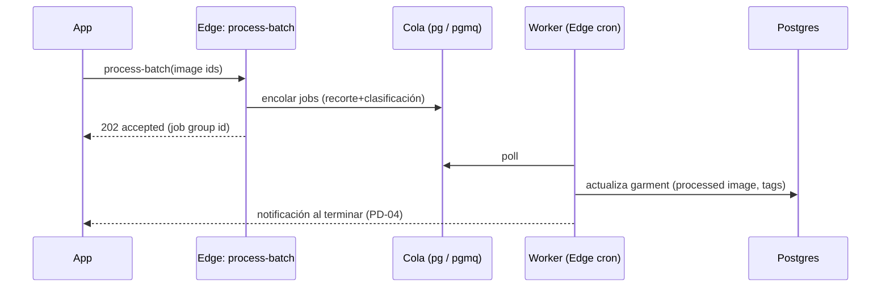

# 08 · API

Dos superficies: (1) **datos CRUD** vía PostgREST + RPC (SDK `supabase-js`, con RLS); (2) **efectos/terceros** vía **Edge Functions**. Los clientes nunca llaman a terceros directamente.

## 8.1 Principios

- **CRUD de entidades del usuario → PostgREST** (auto-REST sobre las tablas, protegido por RLS). Menos código, menos latencia, contrato tipado por tipos generados.
- **Lógica con secretos, terceros o cómputo → Edge Functions** (IA, recorte, clima, procesado en lote, firmas de subida).
- **Consultas complejas → RPC** (funciones SQL expuestas, p. ej. `search_garments`).
- Todo tipado: los repositorios (`packages/data`) envuelven estas llamadas; la app no ve endpoints crudos.

## 8.2 REST (PostgREST) — por entidad

Operaciones estándar mediadas por RLS (`user_id = auth.uid()`), consumidas por repositorios:

| Entidad | Operaciones | Notas |
|---|---|---|
| `garment` | list (filtros: category, favorite, status, collection), get, insert, update, soft-delete (RPC) | list paginada (keyset, §14) |
| `outfit` + `outfit_item` | list, get (con items), insert, update, delete | items en transacción (RPC `save_outfit`) |
| `trip` + `trip_day` + `trip_garment` | CRUD | validación de fechas por trigger |
| `collection` + `collection_item` | CRUD | |
| `style_preference` | list, add, remove | |
| `ai_recommendation` | list (status), update status (dismiss/apply) | |
| `profile` | get, update (prefs) | id = auth.uid() |
| `image_asset` | insert (metadata) | binario va por Storage |

Paginación: **keyset** (`created_at,id` o `name,id`) para escalar (§14), no `offset`.

## 8.3 RPC (funciones SQL expuestas)

| RPC | Firma | Uso |
|---|---|---|
| `search_garments(embedding, count)` | ver §7.11 | búsqueda semántica (el embedding lo genera Edge, ver 8.4) |
| `save_outfit(payload jsonb)` | crea/actualiza outfit + items en **una transacción** | Studio Save (atomicidad de capas) |
| `soft_delete_garment(id)` | marca borrado conservando referencias | Inventory/detalle |
| `assign_outfit_to_day(trip_day_id, outfit_id)` | asigna + recalcula `is_outfit_complete` | Trips |
| `forgotten_pieces(days int)` | prendas con `last_worn_at` > N días | Home (o calculado en cliente sobre lista cacheada) |

## 8.4 Edge Functions (Deno)

Cada función: valida JWT (usuario), aplica **rate-limit** (§13), es **idempotente** donde aplica, y llama a terceros con claves de servidor.

| Función | Entrada | Salida | Terceros |
|---|---|---|---|
| `remove-background` | `image_asset_id` (original) | crea `image_asset` processed; devuelve id/URL | BackgroundRemovalService (`PD-05`) |
| `classify-garment` | `image_asset_id` | `{category, color, materials[], season, style, confidences}` | AiService/OpenAI (`PD-05`) |
| `embed-garment` | `garment_id` o imagen+atributos | escribe `garment.embedding` | modelo embeddings (`PD-05`) |
| `semantic-search` | `query:string` | embeddings de la query → llama RPC `search_garments` | modelo embeddings |
| `recommend-outfit` | `garment_ids[]` / contexto | `{match_score, suggestions[], conflicts[]}` + persiste `ai_recommendation` | AiService |
| `generate-insights` | `user_id` (batch) | crea `ai_recommendation` (forgotten, whispers, wardrobe insight, colecciones IA) | AiService |
| `get-weather` | `location`, `dates[]` | `weather_snapshot[]` (cacheado) | WeatherService (`PD-05`) |
| `process-batch` | `image_asset_ids[]` (Burst/Import) | encola recorte+clasificación; notifica al terminar | interno + `PD-04` |
| `sign-upload` | `type`, `mime` | URL de subida firmada + path | Storage |

Contrato tipado (ejemplo):
```ts
// packages/api/edge/classifyGarment.ts
export async function classifyGarment(imageAssetId: string): Promise<Classification> {
  const { data, error } = await supabase.functions.invoke('classify-garment', {
    body: { image_asset_id: imageAssetId },
  });
  if (error) throw mapEdgeError(error);
  return classificationSchema.parse(data); // Zod valida la respuesta
}
```

## 8.5 Eventos (asíncrono / colas)

Procesado en lote (Burst/Import) y jobs largos no bloquean al cliente:


- **Cola:** `pgmq` (extensión de colas sobre Postgres) o tabla de jobs + `pg_cron` que dispara un worker Edge. ⛔ **PD** mecanismo final (ADR-010).
- **Idempotencia:** cada job tiene clave única (image_asset_id) para evitar doble procesado.

## 8.6 Webhooks

- **Entrantes** (de terceros hacia Woven): p. ej. callbacks de un servicio de recorte asíncrono, o de facturación cuando exista Premium (`PD-02`). Se reciben en una Edge Function con verificación de firma (secreto compartido) e idempotencia.
- **Salientes** (de Woven a terceros): no requeridos en MVP.
- **Auth webhooks (Supabase):** el trigger `on_auth_user_created` (§7.11) cubre la creación de perfil sin webhook externo.
- ⛔ **PD:** webhooks de facturación dependen de `PD-02`.

## 8.7 Manejo de errores y contratos

- Toda respuesta de Edge/RPC se **valida con Zod** en el cliente (`packages/api`), fallando ruidosamente ante contratos rotos.
- Errores mapeados a un tipo de dominio (`AppError` con `code`, `retryable`) → los hooks deciden reintento/rollback.
- Códigos: `AUTH_REQUIRED`, `RATE_LIMITED`, `AI_UNAVAILABLE` (→ fallback), `VALIDATION`, `CONFLICT`, `NETWORK` (→ cola offline).
