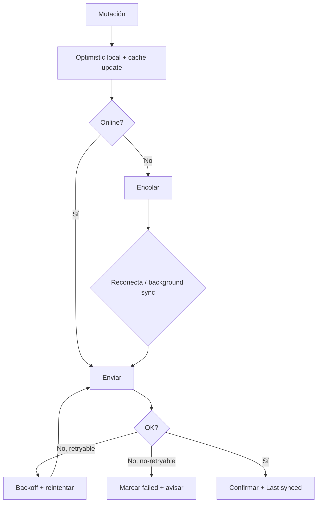

# 10 · Offline · Seguridad · Rendimiento

## 12. Offline

Objetivo: la app **lee siempre** (desde caché) y **escribe siempre** (a cola), reconciliando al reconectar.

### 12.1 Caché
- **TanStack Query persister** (MMKV móvil / IndexedDB web): snapshot del caché de servidor para arranque offline.
- **Imágenes**: disk cache (Expo Image) sobre CDN.
- Al abrir sin red: se hidrata el caché persistido y se muestran datos "stale" con indicador.

### 12.2 Sincronización
- Estrategia **offline-first**: mutaciones se aplican **optimistas** en local y se envían cuando hay red.
- Al recuperar conexión: `onlineManager` (TanStack) dispara reintentos; refetch en foco reconcilia lecturas.
- "Last synced" (Profile) = timestamp de la última sync exitosa.

### 12.3 Conflictos
- Regla base: **last-write-wins por `updated_at`** (servidor autoritativo).
- Entidades con estructura (outfit_item posiciones): la escritura es de conjunto (RPC `save_outfit` transaccional) → el último guardado gana el layout completo.
- ⛔ **PD**: merge fino de outfits editados en dos dispositivos a la vez (raro en MVP; documentado como riesgo).

### 12.4 Colas
- `useOfflineQueue` (Zustand persistido): lista ordenada de operaciones `{id, type, payload, attempts, createdAt}`.
- Tipos encolables: crear prenda (con imagen), favorito, guardar outfit, asignar outfit a día, editar tags.
- La cola se drena en orden; operaciones dependientes respetan orden (crear prenda antes de usarla en outfit).

### 12.5 Retry
- **Backoff exponencial con jitter** (p. ej. 1s, 2s, 4s… máx N) por operación; límite de intentos → marca `failed` y notifica al usuario para reintento manual.
- Errores `NETWORK`/`RATE_LIMITED` → reintentables; `VALIDATION`/`AUTH` → no reintentables (se descartan con aviso).

### 12.6 Background Sync
- **Móvil:** `expo-task-manager` + `expo-background-fetch` para drenar cola y subir imágenes pendientes en background (best-effort; iOS limita). 
- **Web:** Service Worker Background Sync (donde soportado) o sync al recuperar foco/online.
- El procesado IA de imágenes encoladas ocurre server-side tras la subida (§10).

---

## 13. Seguridad

### 13.1 Autenticación
- **Supabase Auth** (JWT). Tokens de acceso de vida corta + refresh. UI de auth = ⛔ **PD-01**.
- Móvil: refresh/session en **`expo-secure-store`** (Keychain/Keystore), nunca en MMKV plano.
- Biometría (FaceID/Touch/Android) para desbloquear la app: `expo-local-authentication` (ajuste Privacy & Security).

### 13.2 Autorización
- MVP sin roles: cada usuario accede solo a lo suyo. Compartir/roles = fuera de alcance (`PD-03`).

### 13.3 JWT
- El SDK adjunta el JWT en cada request; Postgres lo usa en `auth.uid()` para RLS. Edge Functions **verifican el JWT** antes de operar.

### 13.4 RLS
- **Obligatoria en todas las tablas de usuario** (políticas en §7.10). Es la línea de defensa principal: aunque el cliente falle, la BD no expone datos ajenos.
- Tests de integración que verifican aislamiento entre usuarios (§16).

### 13.5 Secrets
- Claves de terceros (IA, clima, recorte) solo en **Supabase secrets** (Edge). Nunca en cliente ni en el repo.
- Variables de entorno por ambiente (dev/staging/prod); rotación documentada.

### 13.6 Rate limiting
- En Edge, por usuario y función (token bucket). Protege coste IA y abuso de subida. Cuotas por plan = `PD-02`.

### 13.7 Protección de imágenes
- Buckets **privados**; acceso solo con **URLs firmadas de vida corta**.
- Políticas de Storage por `user_id` en el path.
- EXIF (geolocalización) eliminado en compresión (§10.2).
- Sin datos personales en query params/URLs (§5.3).

### 13.8 Validaciones
- **Cliente**: Zod en formularios (Captura: Category/Color obligatorios; Trip: fechas).
- **Servidor**: constraints/checks/triggers en Postgres (fechas de viaje, capas de outfit, hex de color) — no confiar solo en cliente.
- **Edge**: validación de entrada y de respuesta de terceros con Zod.

---

## 14. Rendimiento

### 14.1 Virtualización
- Listas largas con **FlashList** (Shopify) en móvil / virtualización en web: Inventory, itinerario de viaje, bandeja del Studio, carruseles. Objetivo p95 fluido con ≥1.000 prendas (PRD §2.3).

### 14.2 Lazy loading
- Rutas/pantallas cargadas bajo demanda (Expo Router / code splitting web).
- Imágenes con carga progresiva + skeleton (ya en diseño).

### 14.3 Infinite scroll
- Inventory usa **paginación keyset** (`useInfiniteQuery`) — no `offset` (evita degradación con muchas filas y duplicados al insertar).

### 14.4 Optimización de imágenes
- Derivados por tamaño (thumbnail en rejillas, full en detalle/Studio); `expo-image` con `contentFit`, `placeholder` (blurhash), disk cache.
- Compresión en cliente (§10.2).

### 14.5 Memoización
- `React.memo`/`useMemo`/`useCallback` en componentes de lista (GarmentCard) y en el lienzo del Studio; selectores Zustand para evitar re-renders globales.

### 14.6 Code splitting
- Web: chunks por ruta (Vite). Móvil: RAM bundles / lazy screens.

### 14.7 Tree shaking
- ESM en todos los paquetes; imports por módulo (no barrels pesados en runtime); `sideEffects:false` donde aplique.

### 14.8 Prefetch
- Prefetch de detalle de prenda al aparecer en viewport; prefetch de imágenes del Studio al abrir la bandeja; prefetch de clima al abrir un viaje.
- TanStack `prefetchQuery` en interacciones probables (hover/press-in).

### 14.9 Objetivos (propuestos; confirmar)
| Métrica | Objetivo |
|---|---|
| Navegación entre tabs | < 100 ms |
| Inventory (cache-warm) | < 500 ms |
| Búsqueda semántica | < 800 ms |
| Recorte/clasificación | `PD` (depende proveedor) |
| Crash-free sessions | ≥ 99.5% |
