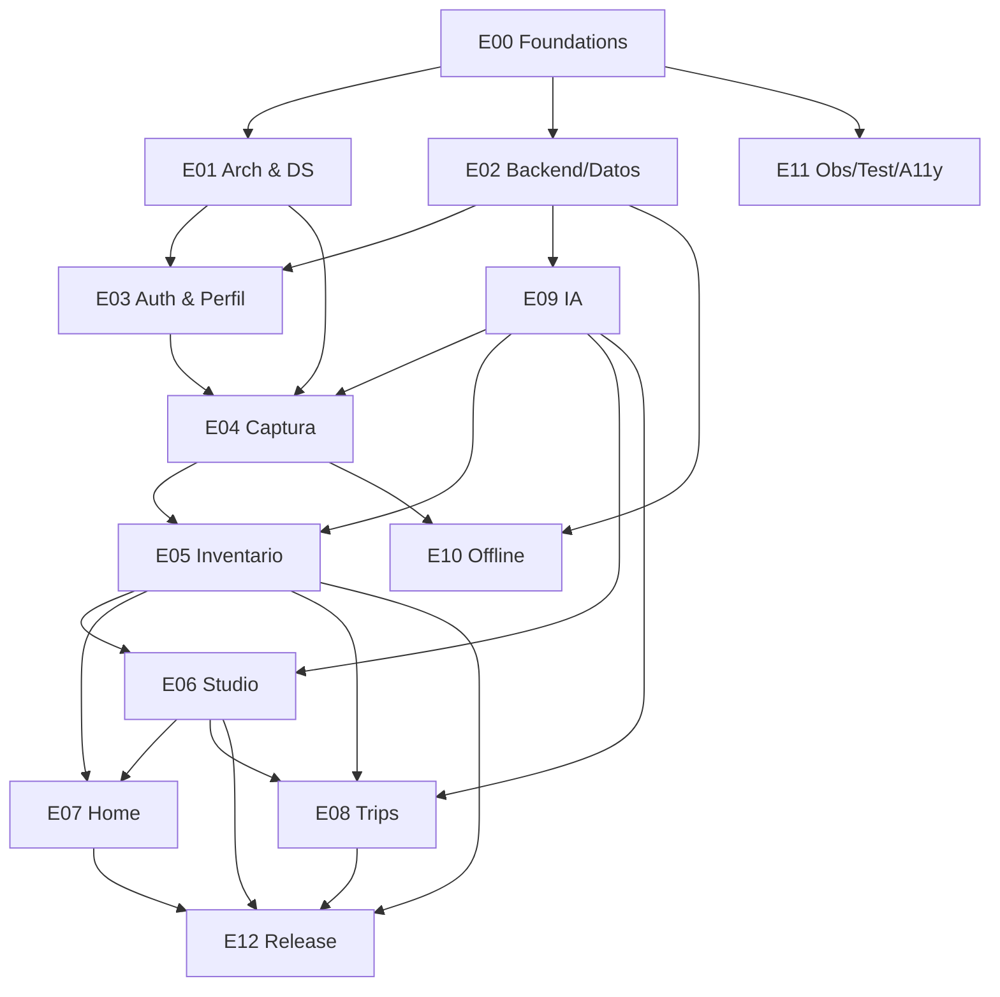
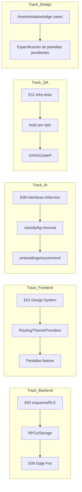

# 01 · Epics, dependencias y paralelización

## 1.1 Mapa de Epics

| Epic | Título | Objetivo | Prioridad | Sprints |
|---|---|---|---|---|
| **E00** | Foundations (repo/monorepo/CI-CD/tooling) | Base ejecutable y automatizada | P0 | S0 |
| **E01** | Arquitectura & Design System | UI base, routing, tema, providers | P0 | S1 |
| **E02** | Backend & Datos (Supabase) | Esquema, RLS, migraciones, storage, tipos | P0 | S1–S2 |
| **E03** | Autenticación & Perfil | Capa técnica de auth + Perfil (UI auth `PD-01`) | P0 | S2 |
| **E04** | Captura & Pipeline de imagen | Cámara→recorte→clasificación→prenda | P0 | S3–S4 |
| **E05** | Inventario | Búsqueda, colecciones, densidades, favoritos | P0 | S4–S5 |
| **E06** | Outfits / Studio | Lienzo, DnD táctil, match score, guardar | P0 | S5–S6 |
| **E07** | Home | Today's Look, Forgotten Pieces, bento | P1 | S6–S7 |
| **E08** | Trips | Viaje, maleta, outfits/día, packing insight | P1 | S7–S8 |
| **E09** | Servicios IA (transversal) | classify/embed/search/recommend/insights | P0 | S3–S8 |
| **E10** | Offline & Sync (transversal) | caché, cola, reintentos, background sync | P1 | S4–S9 |
| **E11** | Observabilidad/Testing/Calidad/A11y (transversal) | telemetría, suites, WCAG AA | P0 | S0–S10 |
| **E12** | Release & Lanzamiento | Alpha→Prod, tiendas, hardening | P0 | S9–S10 |

Transversales (E09/E10/E11) no son un sprint: sus tareas se **intercalan** en los sprints de features.

## 1.2 Features por Epic (resumen; detalle/tareas en `02` y `03`)

- **E00** — F-E00-01 Monorepo (pnpm+Turbo) · F-E00-02 CI/CD · F-E00-03 Tooling (lint/format/test/Storybook) · F-E00-04 Entornos & secrets · F-E00-05 Bootstrap apps (Expo + Web) · F-E00-06 Supabase project.
- **E01** — F-E01-01 Design tokens/preset · F-E01-02 Atoms/Molecules · F-E01-03 Organisms (nav) · F-E01-04 Templates · F-E01-05 Routing/layouts · F-E01-06 Theme (claro/oscuro) · F-E01-07 Providers.
- **E02** — F-E02-01 Migraciones núcleo · F-E02-02 RLS · F-E02-03 Storage buckets/policies · F-E02-04 Tipos generados · F-E02-05 RPCs base · F-E02-06 Seeds referencia.
- **E03** — F-E03-01 AuthService (Supabase) · F-E03-02 Gate/sesión · F-E03-03 Perfil (datos) · F-E03-04 Preferencias de estilo · F-E03-05 Ajustes (dark mode, unidades) · F-E03-06 UI auth (`PD-01`, stub).
- **E04** — F-E04-01 Cámara/permisos · F-E04-02 Compresión/EXIF · F-E04-03 Subida firmada · F-E04-04 Eliminación de fondo · F-E04-05 Clasificación · F-E04-06 Revisión/edición · F-E04-07 Burst · F-E04-08 Import.
- **E05** — F-E05-01 Rejilla virtualizada + densidades · F-E05-02 Búsqueda semántica · F-E05-03 Colecciones · F-E05-04 Favoritos · F-E05-05 Detalle de prenda · F-E05-06 Insight/colección IA.
- **E06** — F-E06-01 Lienzo · F-E06-02 DnD táctil+puntero · F-E06-03 Capas/rotación · F-E06-04 Bandeja de armario · F-E06-05 Match score/estilista · F-E06-06 Guardar/editar outfit · F-E06-07 undo/redo.
- **E07** — F-E07-01 Today's Look · F-E07-02 Forgotten Pieces · F-E07-03 Bento analíticas (con `PD-08/12` ocultas) · F-E07-04 Agenda (`PD-06`).
- **E08** — F-E08-01 Crear viaje · F-E08-02 Clima · F-E08-03 Maleta visual · F-E08-04 Outfits por día · F-E08-05 Packing insight · F-E08-06 Blueprint.
- **E09** — F-E09-01 AiService/EdgeFns · F-E09-02 Embeddings/pgvector · F-E09-03 Recomendación · F-E09-04 Insights batch · F-E09-05 Prompts/guardrails · F-E09-06 Rate-limit/caché/coste.
- **E10** — F-E10-01 Persistencia caché · F-E10-02 Cola offline · F-E10-03 Reintentos/backoff · F-E10-04 Background sync · F-E10-05 Conflictos.
- **E11** — F-E11-01 Telemetría (PostHog/Sentry) · F-E11-02 Suites (unit/int/e2e/visual) · F-E11-03 A11y CI · F-E11-04 Perf budgets.
- **E12** — F-E12-01 Hardening · F-E12-02 EAS build/submit · F-E12-03 Store assets/compliance · F-E12-04 Canales alpha/beta/prod · F-E12-05 Rollback/kill-switch.

## 1.3 Grafo de dependencias (Epics)

**Bloqueos duros (una tarea NO empieza sin la otra):**
- E03/E04/E05/E06/E07/E08 dependen de **E01+E02** (UI base + esquema/RLS).
- E04 depende de **E09** (recorte+clasificación) y de **E03** (usuario para asociar prendas).
- E05 depende de **E04** (necesita prendas) y **E09** (búsqueda semántica).
- E06/E07/E08 dependen de **E05** (inventario como fuente).
- E12 depende de que E04–E08 estén "MVP-complete".

**Bloqueos por `PD` (no técnicos):**
- E03 UI de login/registro ← `PD-01` (crítico para lanzar).
- E07 Agenda ← `PD-06`; analíticas Cost/Sustainability/Style ← `PD-07/08/12`.
- E08 Weight/Space ← `PD-09`.
- Proveedores E09/clima ← `PD-05`.

## 1.4 Paralelización (qué avanza en paralelo)

Tras E00 (semana 1–2), varios tracks corren simultáneamente:

| Track | Puede avanzar en paralelo con | Sincroniza en |
|---|---|---|
| **Backend/Datos** (E02) | Design System (E01), IA interfaces (E09) | Contrato de tipos generados (bloquea repos) |
| **Frontend/DS** (E01) | Backend, IA | Providers listos antes de pantallas feature |
| **IA** (E09) | Backend, Frontend | Edge Fns necesitan esquema (E02) para escribir tags/embeddings |
| **QA/Testing** (E11) | Todos | Cada feature entra con sus tests (no al final) |
| **Diseño** (D) | Todos | Resolver estados vacíos/edge y pantallas `PD` antes de sus sprints |

Regla: **el contrato de datos (E02 tipos generados) es el punto de sincronización maestro**; hasta que existe, frontend/IA trabajan contra mocks/interfaces.
