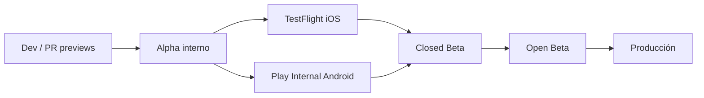

# 05 · Publicación y definición de MVP

## 5.1 Estrategia de canales

Progresión de exposición controlada, apoyada en **EAS** (móvil), hosting web y **feature flags** (PostHog) para gating y kill-switch.

### Alpha (interno) — a partir de S8
- **Quién:** equipo interno.
- **Cómo:** EAS Update canal `staging` + web `staging`.
- **Objetivo:** validar el bucle E2E (capturar→inventario→outfit→home→trip) con datos reales del equipo.
- **Gate de salida:** flujo E2E sin bugs P0; telemetría emitiendo.

### TestFlight (iOS) / Play Internal (Android) — S9–S10
- **Quién:** equipo + allegados de confianza.
- **Cómo:** `eas build` + `eas submit` a TestFlight y a Play Console (pista Internal). Canal `production` de EAS Update para OTAs.
- **Objetivo:** validar builds reales en dispositivos variados, permisos (cámara/foto), rendimiento.
- **Gate de salida:** compliance de tienda revisada (permisos/privacidad); crash-free ≥ objetivo; auditoría WCAG AA pasada.

### Closed Beta — post S10
- **Quién:** lista reducida de usuarios reales invitados (⛔ **PD** requiere `PD-01` auth UI para alta pública).
- **Cómo:** TestFlight external + Play Closed testing.
- **Objetivo:** validar activación (anti cold-start), retención temprana, precisión de IA percibida.
- **Métricas gate:** prendas/1ª sesión, D1/D7, tasa de tags auto-aceptados, crash-free ≥ 99.5%.

### Open Beta → Producción
- **Cómo:** ampliar testers → release en tiendas (fase escalonada de Play; release iOS). Web a `prod`.
- **Gate a Producción:** ver definición de MVP (§5.3) + sin P0/P1 abiertos + rollback ensayado (kill-switch validado).

## 5.2 Requisitos transversales de publicación
- **Compliance:** textos de permisos (cámara, fotos), política de privacidad, manejo de datos e imágenes (privadas), cuestionarios de tienda (App Privacy / Data Safety).
- **`PD-01` (auth UI)** es **prerequisito de Closed Beta pública**: sin registro/login no hay alta de usuarios externos. La alpha/TestFlight interna puede operar con auth técnica + usuarios sembrados.
- **Rollback:** web (redeploy), OTA (republicar update previo), binario (kill-switch por flag + OTA de fix). Ensayar antes de Producción (T-1204).

## 5.3 Definición de MVP terminado (Go/No-Go)

El MVP se considera **terminado** cuando **todas** estas condiciones se cumplen simultáneamente:

**Funcional (bucle central operable en iOS y Android):**
- [ ] Onboarding con 3 vías → Captura en el modo correcto.
- [ ] Captura (Photo/Burst/Import) con recorte + clasificación **editable** crea prendas.
- [ ] Inventario con búsqueda semántica (con fallback), colecciones, 3 densidades, favoritos y detalle.
- [ ] Studio: componer con **drag táctil real** (+ alternativa accesible) y **guardar** outfit.
- [ ] Home: Today's Look + Forgotten Pieces (degradando si faltan clima/agenda).
- [ ] Trips: crear viaje, maleta, outfit por día, packing insight (sin Weight/Space `PD-09`).
- [ ] Perfil: preferencias de estilo, Total Items, ajustes básicos, Log Out.
- [ ] Sincronización offline-first operativa (editar offline → sync).

**Calidad:**
- [ ] WCAG 2.2 AA sin fails A/AA en las 7 pantallas.
- [ ] E2E de flujos críticos verdes (móvil + web).
- [ ] Perf: Inventory fluido con ≥1.000 prendas; p95 dentro de objetivos (TAD §14.9).
- [ ] Crash-free sessions ≥ 99.5%.
- [ ] Cobertura de dominio (`core`) ≥ 80%.

**Operación:**
- [ ] Telemetría KPI (PostHog) + errores (Sentry) + monitor de coste IA activos.
- [ ] Rollback/kill-switch ensayados.
- [ ] RLS con tests de aislamiento verdes.

**Bloqueos resueltos para lanzar públicamente:**
- [ ] `PD-01` (auth UI) resuelto e implementado (prerequisito de alta pública).

> **Elementos explícitamente FUERA del MVP** (no bloquean el Go): listado "Mis outfits" (`PD`), métricas Cost/Sustainability/Style (`PD-07/08/12`), notificaciones (`PD-04`), Data Export (`PD-11`), Share (`PD-03`), Premium (`PD-02`), Weight/Space de Trips (`PD-09`), agenda del Home (`PD-06`).

**Momento exacto del MVP:** al cierre de **S10** con los checkboxes anteriores en verde **y** `PD-01` implementado. Si `PD-01` no está resuelto, el producto queda "MVP-complete técnico" pero **no lanzable públicamente** hasta cerrarlo — hito registrado como Go/No-Go de dirección.
