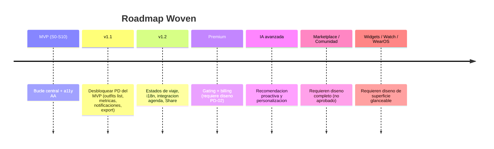

# 06 · Roadmap futuro (post-MVP)

> Solo se planifica lo trazable al diseño aprobado o a bloqueos `PD` ya identificados. Las superficies **no diseñadas** (Marketplace, Comunidad, Widgets, Watch/WearOS) se listan como **horizontes que requieren diseño antes de planificar**, no como trabajo estimado. Cada uno indica su prerequisito.

## Horizonte y prioridad

## v1.1 — Cerrar la deuda `PD` del MVP
| Epic | Contenido | Prerequisito |
|---|---|---|
| E13 · Outfits management | Pantalla "Mis outfits" (listado/gestión) | Diseño de la pantalla (`PD-14`) |
| E14 · Métricas de armario | Cost Per Wear, Sustainability Score, Style Score reales | `PD-07/08/12` (origen de precio + fórmulas) |
| E15 · Notificaciones | Push/in-app: Pending Actions, alertas de clima de Trips | `PD-04` (spec de notificaciones) |
| E16 · Data Export | Export JSON/PDF del armario | `PD-11` (esquema/alcance) |

Valor: convierte métricas y avisos "ocultos en MVP" en funcionalidad real; primer motor de retención adicional.

## v1.2 — Madurez de flujos
| Epic | Contenido | Prerequisito |
|---|---|---|
| E17 · Estados de viaje | Viajes activo/pasado, histórico | `PD` (estados no diseñados) |
| E18 · i18n | Multi-idioma | `PD-10` (set de idiomas) |
| E19 · Integración de agenda | Origen real del "Daily Agenda" del Home | `PD-06` (integración calendario) |
| E20 · Share | Compartir outfit (imagen/enlace) | `PD-03` (flujo + formato) + posible SSR web (ADR-002) |

## Premium — monetización
| Epic | Contenido | Prerequisito |
|---|---|---|
| E21 · Premium | Tiers, límites por plan, paywall, billing | **`PD-02`** (sin diseño de paywall/tiers/precios) |

- La arquitectura ya está preparada (feature flags PostHog, rate-limits por usuario, RLS) para **gating** sin refactor; solo falta la **decisión de negocio y su diseño**.
- Palancas naturales de plan: nº de prendas, cuota de IA (recorte/recomendación), almacenamiento de imágenes.

## IA avanzada
| Epic | Contenido | Prerequisito |
|---|---|---|
| E22 · Recomendación proactiva | Sugerencias de outfit anticipadas (según agenda/clima/histórico) | Datos de uso + `PD-06` agenda |
| E23 · Personalización | Aprendizaje de preferencias (feedback loop de tags/outfits) | Consentimiento de uso de datos (`PD` privacidad) |

- Construible sobre `AiService` existente (interfaz estable, ADR-007). Requiere volumen de datos y política de privacidad/consentimiento.

## Superficies nuevas (requieren diseño antes de planificar)
| Horizonte | Estado | Prerequisito duro |
|---|---|---|
| **Marketplace** | ⛔ No diseñado | Diseño completo + modelo de negocio + legal/pagos |
| **Comunidad** | ⛔ No diseñado | Diseño + moderación + privacidad + replanteo de navegación (5 tabs ya llenos) |
| **Widgets** (iOS/Android) | ⛔ No diseñado | Diseño de widget glanceable (p. ej. "outfit del día") |
| **Apple Watch** | ⛔ No diseñado | Subsistema glanceable propio (outfit del día / packing) |
| **WearOS** | ⛔ No diseñado | Ídem Watch |

- Estas superficies **no se estiman** hasta tener diseño aprobado. El backend/datos actuales (outfits, trips, today's look) son reutilizables como fuente para widgets/wearables cuando se diseñen.
- Riesgo estructural a considerar en Comunidad/Marketplace: la navegación de 5 destinos está completa; añadir ejes exige repensar la arquitectura de navegación (no un simple tab más).

## Principio para el post-MVP
Cada epic futuro sigue el mismo estándar del plan: **IDs únicos, DoD, testing dentro del epic, y nada de `PD` asumido**. Ningún horizonte "no diseñado" entra en un sprint sin su diseño aprobado y sus `PD` resueltos.
