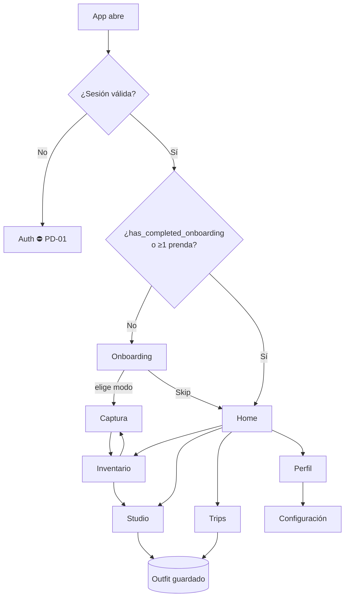
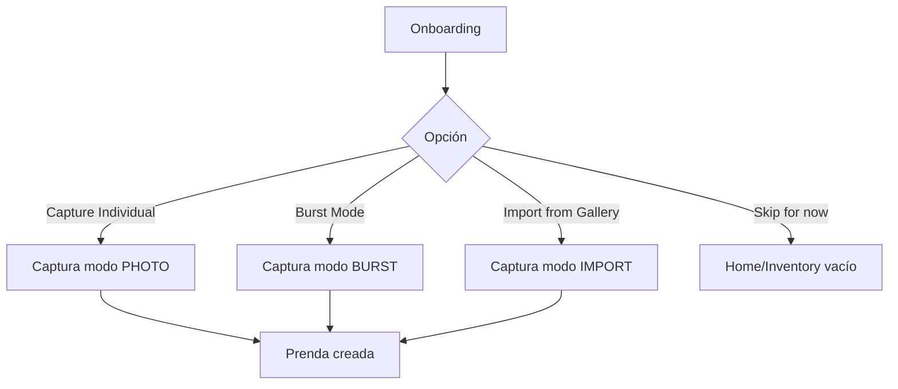
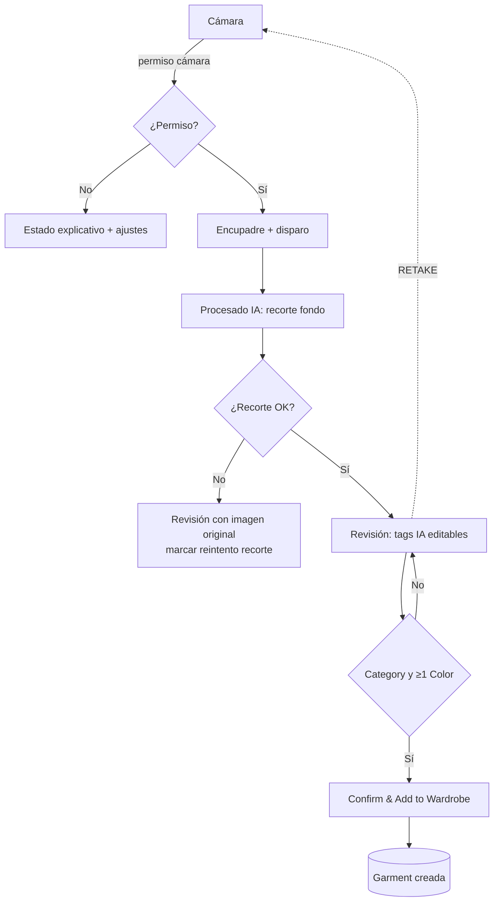
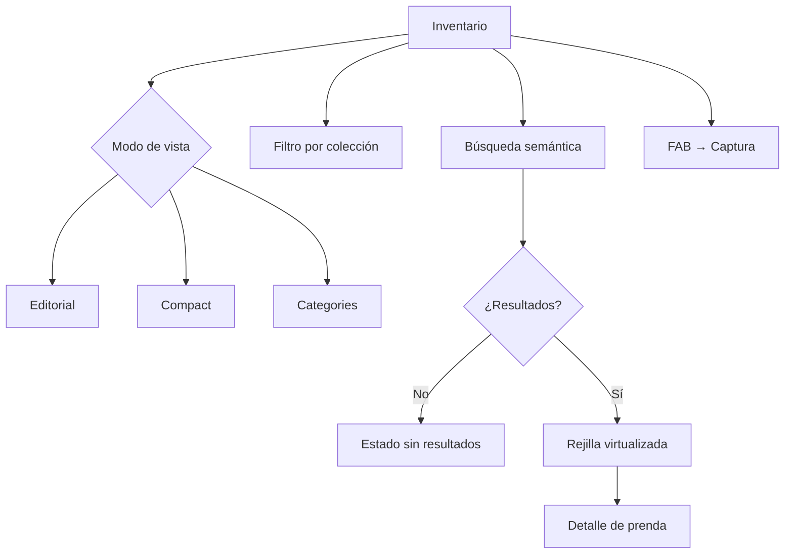
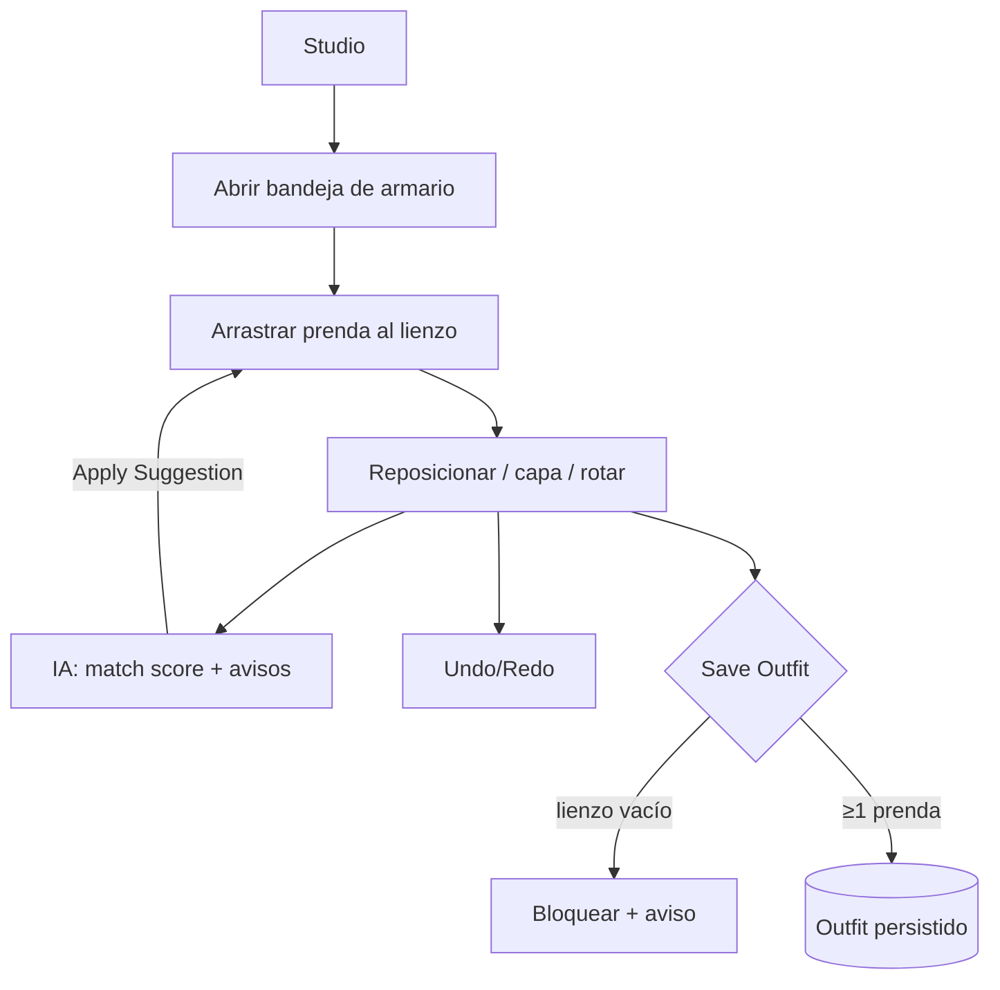
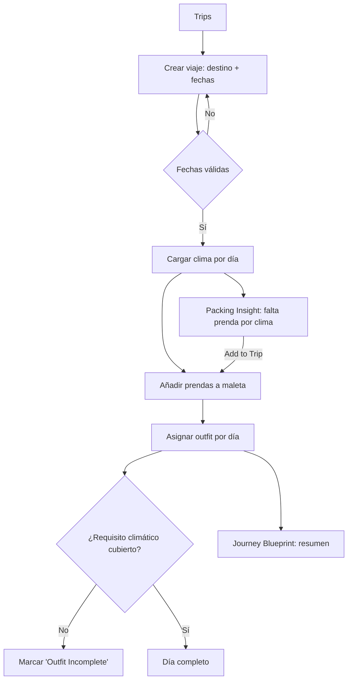
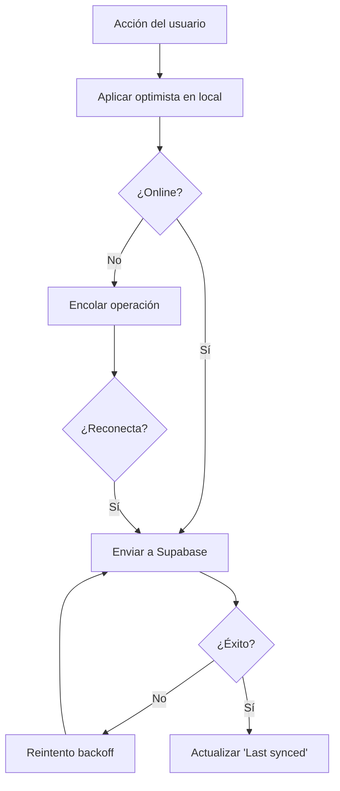

# 03 · User Stories y Flujos

## 4. User Stories

Formato: **Como** [rol] · **Quiero** [necesidad] · **Para** [beneficio] · **CA** [criterios].
Rol único en MVP: *usuario autenticado* (no hay roles diferenciados en el diseño; roles/planes = `PD-02`).

### 4.1 Onboarding

**US-ON-01** — Como usuario nuevo, quiero elegir cómo empezar a catalogar (individual, ráfaga o import), para hacerlo a mi ritmo.
- CA: Se muestran 3 opciones; cada una abre el modo correcto de Captura; existe "Skip for now".

**US-ON-02** — Como usuario, quiero poder saltar el onboarding, para entrar a la app sin catalogar aún.
- CA: "Skip for now" entra con estado vacío y CTA de captura; el onboarding no reaparece con ≥1 prenda.

**US-ON-03** — Como usuario, quiero ver un consejo de fotografía, para obtener buenos recortes.
- CA: La tarjeta de consejo es visible; "View Photography Guide" abre la guía (`PD` destino).

### 4.2 Captura

**US-CAP-01** — Como usuario, quiero fotografiar una prenda y que se recorte el fondo automáticamente, para tener una imagen limpia sin editar.
- CA: Tras el disparo se ejecuta el recorte; si falla, puedo usar la original.

**US-CAP-02** — Como usuario, quiero que la IA detecte categoría, color, material, estación y estilo, para no rellenarlo a mano.
- CA: La etapa de revisión muestra los 5 campos prellenados y editables.

**US-CAP-03** — Como usuario, quiero corregir cualquier etiqueta antes de guardar, para mantener el armario preciso.
- CA: Puedo cambiar cada campo; Confirm exige Category y ≥1 Color.

**US-CAP-04** — Como usuario, quiero capturar varias prendas en ráfaga, para catalogar rápido.
- CA: Modo Burst captura en secuencia y procesa en lote; notifica al terminar.

**US-CAP-05** — Como usuario, quiero importar fotos de mi galería, para catalogar sin volver a fotografiar.
- CA: Modo Import permite selección múltiple; omite fotos sin prendas e informa del resultado.

**US-CAP-06** — Como usuario, quiero capturar sin conexión, para no depender de la red.
- CA: La captura se encola y el procesado ocurre al recuperar conexión.

### 4.3 Inventario

**US-INV-01** — Como usuario, quiero buscar en lenguaje natural ("algo para una cena con lluvia"), para encontrar ropa por contexto.
- CA: La búsqueda devuelve prendas relevantes por atributos + semántica.

**US-INV-02** — Como usuario, quiero filtrar por colecciones, para ver subconjuntos de mi armario.
- CA: Al pulsar un chip, la rejilla se restringe a esa colección.

**US-INV-03** — Como usuario, quiero cambiar la densidad de la vista (Editorial/Compact/Categories), para adaptar la escala.
- CA: Cada modo cambia la rejilla y la preferencia persiste.

**US-INV-04** — Como usuario, quiero marcar prendas como favoritas, para acceder rápido a ellas.
- CA: El favorito persiste y se refleja al recargar.

**US-INV-05** — Como usuario, quiero añadir prendas desde el inventario, para ampliar el armario sin cambiar de sección.
- CA: El FAB abre Captura.

**US-INV-06** — Como usuario, quiero que la IA agrupe prendas en colecciones útiles, para descubrir combinaciones.
- CA: La Insight card puede crear una colección; "View Collection" la abre.

### 4.4 Studio / Outfits

**US-STU-01** — Como usuario, quiero arrastrar prendas de mi armario a un lienzo, para componer un outfit.
- CA: Drag táctil (móvil) y con puntero (web) desde la bandeja al lienzo.

**US-STU-02** — Como usuario, quiero recolocar, cambiar de capa y rotar prendas, para ajustar la composición.
- CA: Las tres acciones funcionan y persisten al guardar.

**US-STU-03** — Como usuario, quiero deshacer/rehacer, para experimentar sin miedo.
- CA: undo/redo cubren add/move/layer/rotate/delete.

**US-STU-04** — Como usuario, quiero que la IA me diga si el conjunto encaja y me sugiera piezas, para mejorar el outfit.
- CA: Se muestra Match Score y avisos; "Apply Suggestion" añade la prenda propuesta.

**US-STU-05** — Como usuario, quiero guardar el outfit, para reutilizarlo.
- CA: Save Outfit persiste el outfit con posiciones; bloquea si el lienzo está vacío.

### 4.5 Viajes

**US-TRP-01** — Como usuario, quiero crear un viaje con destino y fechas, para planificar el equipaje.
- CA: Validación de fechas; carga de clima si disponible.

**US-TRP-02** — Como usuario, quiero asignar un outfit a cada día, para saber qué llevaré.
- CA: Cada día admite un outfit; días sin outfit muestran "Add Outfit".

**US-TRP-03** — Como usuario, quiero que la IA me avise si me falta una prenda para el clima, para no olvidarla.
- CA: Packing Insight sugiere la prenda ausente con "Add to Trip".

**US-TRP-04** — Como usuario, quiero ver qué días tienen el outfit incompleto, para completarlos.
- CA: Los días con requisito no cubierto muestran "Outfit Incomplete".

### 4.6 Perfil / Configuración

**US-PRF-01** — Como usuario, quiero gestionar mis preferencias de estilo, para mejorar las recomendaciones.
- CA: Añadir/quitar tags persiste.

**US-PRF-02** — Como usuario, quiero ver cuántas prendas tengo, para conocer mi armario.
- CA: Total Items coincide con Inventory.

**US-PRF-03** — Como usuario, quiero cerrar sesión, para proteger mi cuenta.
- CA: Log Out cierra sesión y limpia estado local.

**US-CFG-01** — Como usuario, quiero activar el modo oscuro, para usar la app cómodamente de noche.
- CA: Conmuta claro/oscuro/sistema y persiste.

**US-CFG-02** — Como usuario, quiero controlar privacidad y seguridad (biometría), para proteger mi armario.
- CA: 🟡 según `PD` de Privacy & Security.

### 4.7 Transversales

**US-SYN-01** — Como usuario con varios dispositivos, quiero que mi armario esté sincronizado, para acceder desde cualquiera.
- CA: Un cambio en A aparece en B tras sync; cambios offline se sincronizan al reconectar.

**US-A11Y-01** — Como usuario con lector de pantalla, quiero texto alternativo e interacción por teclado, para usar la app.
- CA: Cumple §14 (alt, foco, roles, contraste, reduced-motion).

> **Historias bloqueadas por `PD`** (no estimables hasta definición): sign-up/login (`PD-01`), compartir outfit (`PD-03`), notificaciones (`PD-04`), export de datos (`PD-11`), Premium/gating (`PD-02`), Cost-per-wear/Sustainability/Style score (`PD-07/08/12`).

---

## 5. Flujos

### 5.1 Flujo global (mapa de la app)



### 5.2 Onboarding



### 5.3 Captura (modo Photo)



### 5.4 Captura (Burst / Import — procesado en lote)

```mermaid
flowchart TD
    B1[Captura N fotos / selección galería] --> B2[Encolar items]
    B2 --> B3[Procesado en background: recorte + clasificación]
    B3 --> B4{¿Es prenda? (Import)}
    B4 -- No --> B5[Omitir + informar]
    B4 -- Sí --> B6[(Garment con tags provisionales)]
    B6 --> B7[Notificar al terminar]
    B7 --> B8[Usuario revisa/edita desde detalle]
```

### 5.5 Inventario (búsqueda y vista)



### 5.6 Studio (crear outfit)



### 5.7 Viajes



### 5.8 Sincronización (offline-first)


