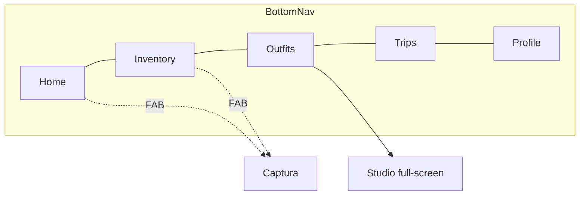
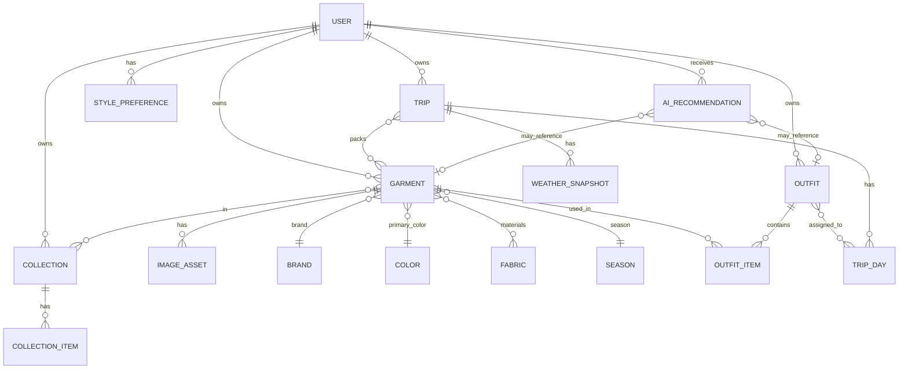

# 04 · Arquitectura de navegación y Modelo de datos

## 6. Arquitectura de navegación

### 6.1 Taxonomía única (unificada en el diseño aprobado)

**Home · Inventory · Outfits · Trips · Profile** — 5 destinos raíz. Iconos canónicos:

| Destino | Icono (Material Symbols) | Pantalla |
|---|---|---|
| Home | `home` | `home_woven_2.0_utility` |
| Inventory | `dry_cleaning` | `inventory_woven_2.0_scalable` |
| Outfits | `checkroom` | `outfits_woven_final` (Studio) |
| Trips | `travel_explore` | `trips_woven_final` |
| Profile | `person` | `profile_woven_final` |

Superficies **fuera de la barra** (flujos enfocados): **Onboarding** (sin nav) y **Captura** (full-screen con cierre).

### 6.2 Móvil (iOS/Android)

- **Bottom Navigation Bar** persistente con los 5 destinos, **icono + etiqueta**, estado activo relleno + color primario.
- **FAB "add"** contextual en Home e Inventory → Captura.
- **Captura** y **Onboarding**: full-screen, **suprimen** la bottom nav (journey enfocado). Captura se cierra con `close`/`history.back`.
- **Studio**: full-screen de edición con cabecera propia (close · título · undo/redo · Save); la bottom nav se mantiene según diseño (activo: Outfits).
- Gestos: scroll vertical en listas; scroll horizontal en carruseles (Forgotten Pieces, colecciones, bandeja Studio); drag táctil en el lienzo del Studio.

### 6.3 Web (React)

- **Top Navigation Bar** con wordmark "Woven" + enlaces de texto (Home · Inventory · Outfits · Trips · Profile) + avatar. (Presente en Home, Trips, Profile del diseño.)
- Layout centrado con `max-width` (contenedor) y márgenes amplios (editorial).
- La bottom nav móvil se oculta en breakpoint `md+`; navegación superior en su lugar.
- Studio: lienzo con panel/paleta lateral y bandeja inferior; drag con puntero.

### 6.4 Tablet

- **Responsive híbrido** (design system: 12-col desktop / 4-col móvil). En tablet:
  - Rejillas de Inventory aumentan columnas según breakpoint (Editorial 2–4, Compact hasta 8).
  - Home/Trips usan bento multi-columna.
  - Navegación: 🟡 usar top nav en horizontal (ancho ≥ `md`) y bottom nav en vertical estrecho. ⛔ **PD** breakpoint exacto de conmutación tablet (proponer: top nav ≥ 768px de ancho).
- Studio en tablet: lienzo amplio + bandeja; ideal para drag.

### 6.5 Reglas de navegación

- Cambiar de tab **preserva el estado** de cada pila (scroll, filtros de Inventory, borrador de Studio). 🟡
- Deep links / rutas (Expo Router): `PD` esquema exacto de URLs; se propone: `/home`, `/inventory`, `/inventory/:garmentId`, `/outfits` (Studio), `/outfits/:outfitId`, `/trips`, `/trips/:tripId`, `/profile`, `/capture?mode=photo|burst|import`, `/onboarding`.
- Back: Captura y Studio cierran hacia la superficie de origen.

---

## 7. Modelo de datos

> Backend: **Supabase (Postgres)**. Convenciones: PK `uuid` (`id`), `user_id uuid` en toda entidad de usuario (RLS §12), `created_at`/`updated_at timestamptz`, borrado lógico con `deleted_at` donde se indica. Nombres en `snake_case`.

### 7.1 Diagrama entidad-relación

### 7.2 Entidades

#### User (perfil)
| Campo | Tipo | Restricciones | Notas |
|---|---|---|---|
| id | uuid | PK, = `auth.users.id` | 1:1 con Supabase Auth |
| display_name | text | | "Julian Thorne" |
| email | text | único | de Auth |
| avatar_asset_id | uuid | FK→image_asset, null | |
| has_completed_onboarding | bool | default false | §3.1 |
| view_density_pref | enum(editorial,compact,categories) | default editorial | §3.3 |
| theme_pref | enum(light,dark,system) | default system | §3.11 |
| units_pref | enum(metric,imperial) | default metric | §3.11 |
| language | text | default 'en-GB' | `PD-10` |
| created_at / updated_at | timestamptz | | |

⛔ **PD:** campos de plan/suscripción (`PD-02`), privacidad (`PD` Privacy mode/Blocked brands).

#### Garment (prenda)
| Campo | Tipo | Restricciones | Notas |
|---|---|---|---|
| id | uuid | PK | |
| user_id | uuid | FK→user, NOT NULL | RLS |
| name | text | NOT NULL | "Structured Wool Overcoat" |
| category_id | uuid/enum | NOT NULL | §7.3 taxonomía de categoría |
| brand_id | uuid | FK→brand, null | "Loro Piana" |
| primary_color_id | uuid | FK→color, NOT NULL | swatch principal |
| season_id | uuid/enum | null | §7.3 |
| style | text[] | null | estilos (Minimalist…) |
| original_image_id | uuid | FK→image_asset | foto original |
| processed_image_id | uuid | FK→image_asset, null | recorte de fondo |
| is_favorite | bool | default false | §3.3 |
| status | enum(processing,active,archived) | default processing | ciclo de vida |
| last_worn_at | timestamptz | null | "Forgotten Pieces" |
| purchase_price | numeric | null | ⛔ **PD-07** (cost-per-wear) |
| deleted_at | timestamptz | null | soft-delete (§3.5) |
| created_at / updated_at | timestamptz | | |

Relaciones: N materiales vía `garment_fabric` (M:N con Fabric); N colecciones vía `collection_item`.

#### Outfit
| Campo | Tipo | Restricciones | Notas |
|---|---|---|---|
| id | uuid | PK | |
| user_id | uuid | FK, NOT NULL | |
| name | text | null | ⛔ **PD** (no hay campo en diseño) |
| match_score | int | 0–100, null | IA (§11) |
| occasion | text | null | 🟡 |
| cover_image_id | uuid | FK→image_asset, null | render del lienzo |
| created_at / updated_at | timestamptz | | |

#### OutfitItem (prenda posicionada en un outfit)
| Campo | Tipo | Restricciones |
|---|---|---|
| id | uuid | PK |
| outfit_id | uuid | FK→outfit, NOT NULL |
| garment_id | uuid | FK→garment, NOT NULL |
| pos_x / pos_y | numeric | posición en lienzo |
| z_index | int | capa |
| rotation | numeric | grados |
| scale | numeric | default 1 |

Restricción: un outfit debe tener ≥1 item para persistirse (regla de app; en BD `PD` si se fuerza con trigger).

#### Trip
| Campo | Tipo | Restricciones | Notas |
|---|---|---|---|
| id | uuid | PK | |
| user_id | uuid | FK, NOT NULL | |
| destination | text | NOT NULL | "Paris, France" |
| start_date / end_date | date | NOT NULL, start ≤ end | |
| status | enum(upcoming,active,past) | default upcoming | ⛔ **PD** estados no diseñados salvo upcoming |
| weight_est_kg | numeric | null | ⛔ **PD-09** no calcular |
| space_remaining_pct | int | null | ⛔ **PD-09** |
| created_at / updated_at | timestamptz | | |

#### TripDay
| Campo | Tipo | Restricciones |
|---|---|---|
| id | uuid | PK |
| trip_id | uuid | FK→trip, NOT NULL |
| date | date | dentro del rango del viaje |
| outfit_id | uuid | FK→outfit, null (1 por día) |
| is_outfit_complete | bool | derivado (§3.7) |
| label | text | null | "Arrival & Le Marais" |

Maleta: M:N Trip↔Garment vía `trip_garment`.

#### Collection
| Campo | Tipo | Restricciones | Notas |
|---|---|---|---|
| id | uuid | PK | |
| user_id | uuid | FK, NOT NULL | |
| name | text | NOT NULL | "Evening Wear" |
| is_ai_generated | bool | default false | "Dusk Essentials" |
| created_at / updated_at | timestamptz | | |

`CollectionItem`: (collection_id, garment_id) — M:N.

#### AIRecommendation
| Campo | Tipo | Restricciones | Notas |
|---|---|---|---|
| id | uuid | PK | |
| user_id | uuid | FK, NOT NULL | |
| type | enum(outfit_suggestion,forgotten_piece,packing_insight,wardrobe_insight,wardrobe_whisper,texture_clash,nudge) | NOT NULL | cubre todas las apariciones IA |
| context | jsonb | | payload contextual |
| garment_id | uuid | FK, null | referencia opcional |
| outfit_id | uuid | FK, null | referencia opcional |
| trip_id | uuid | FK, null | |
| message | text | | copy mostrado |
| status | enum(active,dismissed,applied) | default active | |
| created_at | timestamptz | | |

#### WeatherSnapshot
| Campo | Tipo | Restricciones | Notas |
|---|---|---|---|
| id | uuid | PK | |
| trip_id | uuid | FK→trip, null | o por ubicación de Home |
| date | date | | por día |
| temp_c | numeric | | "14°C" |
| condition | text | | "Cloudy", "Rain" |
| location | text | | |
| fetched_at | timestamptz | | caché/expiración |

⛔ **PD-05:** proveedor de clima.

#### ImageAsset
| Campo | Tipo | Restricciones | Notas |
|---|---|---|---|
| id | uuid | PK | |
| user_id | uuid | FK, NOT NULL | |
| storage_path | text | NOT NULL | Supabase Storage |
| type | enum(original,processed,avatar,outfit_cover) | NOT NULL | |
| width / height | int | null | |
| mime | text | | JPEG/PNG/HEIC |
| bytes | int | | tras compresión |
| created_at | timestamptz | | |

#### Brand
| Campo | Tipo | Restricciones |
|---|---|---|
| id | uuid | PK |
| name | text | único (por usuario o global `PD`) |

🟡 Brands vistas: Loro Piana, Equipment, Common Projects, Theory, Celine, Sunspel. ⛔ **PD** si el catálogo es global curado o libre por usuario.

#### Color
| Campo | Tipo | Restricciones | Notas |
|---|---|---|---|
| id | uuid | PK | |
| name | text | | "Charcoal Grey", "Cream" |
| hex | text | | swatch |

#### Fabric (material)
| Campo | Tipo | Restricciones | Notas |
|---|---|---|---|
| id | uuid | PK | |
| name | text | único | "Linen", "Wool", "Cashmere", "Silk", "Cotton", "Denim", "Leather" |

#### Season
Enum/tabla de referencia: `Spring, Summer, Fall, Winter` (del selector de Captura).

#### StylePreference
| Campo | Tipo | Restricciones |
|---|---|---|
| id | uuid | PK |
| user_id | uuid | FK, NOT NULL |
| tag | text | NOT NULL, único por usuario |

🟡 Valores vistos: Minimalist, Tailored, Monochromatic, Tech-wear.

### 7.3 Taxonomías de referencia (del diseño)

- **Category** (de selects/labels): Shirts & Blouses, T-Shirts, Knitwear, Outerwear, Tops, Bottoms, Shoes/Footwear, Accessories, Tailoring, Essentials, Evening, Work, Casual. ⛔ **PD** taxonomía canónica y jerarquía final (hay mezcla de categoría y "ocasión"/uso; consolidar con Producto).
- **Season**: Spring, Summer, Fall, Winter.
- **Style**: Minimalist, Casual, Formal (+ tags de perfil).
- **Color**: catálogo de swatches (mín. los vistos: cream, white, brown/terracotta, dark teal/charcoal, navy, black, amber).

### 7.4 Restricciones e integridad

- Toda entidad de usuario: `user_id NOT NULL` + RLS por `auth.uid()` (§12).
- `TripDay.date` ∈ [`Trip.start_date`, `Trip.end_date`].
- `Garment` con `status='processing'` puede no tener `processed_image_id` aún.
- Soft-delete de `Garment`: no se borra físicamente si está referenciada por `OutfitItem`/`trip_garment` (integridad de outfits/viajes, §3.5).
- `OutfitItem.z_index` único por outfit recomendado (orden de capas).
