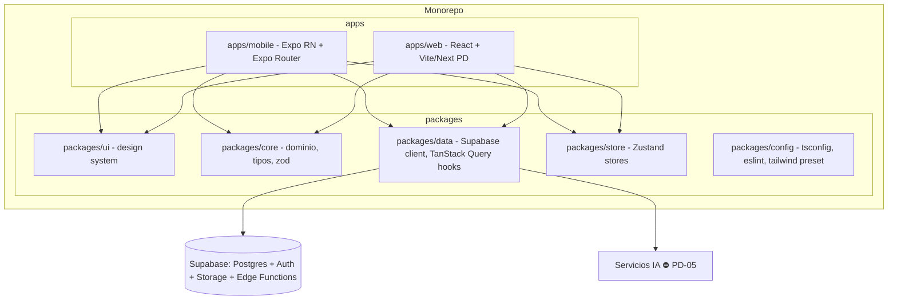

# 05 · Arquitectura técnica · Componentes · Design System

## 8. Arquitectura técnica

### 8.1 Visión general

Monorepo con apps móvil (Expo/RN) y web (React), compartiendo lógica de dominio, tipos, cliente de datos y (donde sea viable) design system.



### 8.2 Decisiones y justificación

| Decisión | Justificación |
|---|---|
| **Monorepo** (pnpm workspaces + Turborepo) | Compartir tipos, dominio, cliente de datos y stores entre móvil y web; evitar duplicación; builds incrementales. |
| **React Native + Expo** | Plataforma principal (móvil). Expo simplifica cámara, imágenes, permisos, OTA updates, build (EAS). Requisitos de Captura (cámara/galería) cubiertos por SDK Expo. |
| **Expo Router** | Enrutado basado en ficheros, deep links y rutas compartibles; alinea con la estructura de navegación (§6.5). |
| **React Web** | Segunda plataforma (Web). Comparte dominio/datos. ⛔ **PD** meta-framework (Vite SPA vs Next.js) — decidir según necesidad de SSR/SEO. |
| **Supabase** | Postgres gestionado + Auth + Storage + RLS + Edge Functions. Cubre auth, datos, imágenes y lógica servidor (IA orquestada en Edge Functions). RLS = seguridad por fila nativa (§12). |
| **TypeScript** | Tipado end-to-end; tipos de BD generados desde Supabase; contratos compartidos en `packages/core`. |
| **TanStack Query** | Estado de servidor: caché, revalidación, reintentos, optimistic updates, offline persistence. Base de §13. |
| **Zustand** | Estado de cliente/UI efímero (borrador del lienzo del Studio, filtros de Inventory, modo de vista, cola offline). Ligero, sin boilerplate. |
| **Tailwind (preset compartido)** | El diseño ya está en Tailwind con tokens; se extrae a un preset compartido (`packages/config`) → NativeWind en móvil, Tailwind en web. |

### 8.3 Capas

- **Presentación**: componentes (§9) + pantallas (Expo Router / rutas web).
- **Estado servidor**: TanStack Query hooks en `packages/data` (queries/mutations tipadas contra Supabase).
- **Estado cliente**: Zustand (`packages/store`).
- **Dominio**: tipos, esquemas Zod de validación, reglas puras en `packages/core`.
- **Backend**: Supabase (Postgres+RLS, Storage, Auth) + **Edge Functions** para orquestar IA (recorte, clasificación, embeddings, recomendación).

### 8.4 Integración de IA (orquestación)

- Las llamadas a modelos de IA (recorte, clasificación, embeddings, recomendación) se orquestan en **Supabase Edge Functions** (no directamente desde el cliente) para: proteger claves, aplicar rate-limits (§12), y desacoplar proveedor (`PD-05`).
- Flujo asíncrono para lote (Burst/Import): job en background + notificación (`PD-04`).
- Búsqueda semántica: embeddings almacenados (pgvector) — ⛔ **PD-05** modelo de embeddings.

### 8.5 Drag & Drop del Studio (nota de implementación)

El diseño incluye un *simulador* de drag. Implementación real requerida:
- Móvil: gestos con `react-native-gesture-handler` + `react-native-reanimated` (drag, rotación, escala, capas). Soporte táctil obligatorio.
- Web: DnD con puntero (`@dnd-kit` o equivalente) — ⛔ **PD** librería final.

### 8.6 Estructura de carpetas (propuesta)

```
woven/
├─ apps/
│  ├─ mobile/            # Expo Router, pantallas, navegación
│  └─ web/               # React
├─ packages/
│  ├─ ui/                # Atomic Design (§9)
│  ├─ core/              # tipos, zod, reglas de dominio
│  ├─ data/              # supabase client, tanstack hooks
│  ├─ store/             # zustand
│  └─ config/            # tailwind preset, tsconfig, eslint
├─ supabase/             # migrations, RLS policies, edge functions
└─ docs/PRD/             # este PRD
```

⛔ **PD:** versiones exactas de dependencias, CI/CD (EAS/Vercel), gestión de entornos (dev/staging/prod).

---

## 9. Componentes (Atomic Design)

> Reutilizables en `packages/ui`. Derivados de las 7 pantallas. Los nombres son propuestos.

### 9.1 Atoms
- `Text` (variantes tipográficas: display-lg, headline-md, title-sm, body-lg, body-md, label-caps — §10)
- `Button` (Primary charcoal / Secondary ghost con borde) — 44px min
- `IconButton` (Material Symbols)
- `Icon` (wrapper Material Symbols Outlined)
- `Chip` / `Tag` (pill; estados: default, activo, eliminable con `×`)
- `Input` (borde inferior; label en `label-caps`)
- `Select` (Category/Season/Style)
- `ColorSwatch` (círculo seleccionable)
- `Avatar` (circular)
- `Badge` ("AI DETECTED", "Outfit 01")
- `ProgressBar` (Space Remaining, Style Score)
- `Skeleton` (carga de prendas)
- `Divider` / hairline
- `Fab` (add)

### 9.2 Molecules
- `SearchBar` (semántica, icono + input)
- `CollectionChipRow` (scroll horizontal de colecciones)
- `ViewModeToggle` (Editorial/Compact/Categories)
- `GarmentCard` (imagen recortada + categoría + nombre + color•marca + favorito) — variantes Editorial/Compact/List
- `TrayItem` (miniatura arrastrable de la bandeja del Studio)
- `AgendaItem` (hora + evento)
- `PendingActionItem` (punto + texto)
- `ForgottenPieceCard` (prenda + "AI NUDGE" / "last worn")
- `DailyOutfitRow` (día + miniaturas de outfit + estado incomplete)
- `SuitcaseItem` (prenda de maleta con overlay)
- `SettingRow` (icono + título + subtítulo + chevron)
- `StylePreferenceChip` (tag eliminable)
- `StatCard` (Cost Per Wear, Total Items, Sustainability — ocultos si `PD`)
- `WeatherPill` (temp + condición)
- `AiInsightBanner` (borde + gradiente sutil + acción)

### 9.3 Organisms
- `BottomNavBar` / `TopNavBar` (5 destinos, §6)
- `CaptureCamera` (viewfinder + modos + controles)
- `CaptureProcessing` (recorte + animación)
- `CaptureReviewForm` (5 campos editables + confirm + sugerencia)
- `InventoryGrid` (virtualizado, 3 densidades)
- `StudioCanvas` (lienzo + items arrastrables + match score + estilista)
- `StudioTray` (bandeja de armario colapsable)
- `StudioToolPalette` (grid/IA/delete)
- `TodaysLookHero` (imagen + clima + razón)
- `WardrobeAnalyticsBento` (Home/Profile)
- `TripHeader` (destino + fechas + clima + métricas)
- `VisualSuitcaseGrid`
- `DailyItinerary` (lista de días)
- `AccountSettingsList`
- `ProfileHeader`

### 9.4 Templates
- `TabScreenTemplate` (nav + scroll + FAB opcional)
- `FullScreenFlowTemplate` (Captura, sin nav)
- `EditorTemplate` (Studio: cabecera + lienzo + bandeja)
- `EmptyStateTemplate` (inventario/colección/resultados vacíos)
- `TwoColumnTemplate` (Profile: sidebar + contenido, web/tablet)

### 9.5 Pages
- `OnboardingPage`
- `CapturePage`
- `InventoryPage`
- `StudioPage` (Outfits)
- `HomePage`
- `TripsPage` · `TripDetailPage` (🟡)
- `ProfilePage` · `SettingsDetailPages` (por ítem, según `PD`)
- ⛔ `AuthPages` (`PD-01`), `OutfitsListPage` (`PD`), `ShareFlow` (`PD-03`)

---

## 10. Design System

> Fuente única: `design/woven/DESIGN.md`. Se implementa como preset Tailwind compartido (NativeWind + web).

### 10.1 Color (tokens Material-3, valores Woven)

Paleta neutra editorial (ivory/charcoal). Tokens clave:

| Token | Valor |
|---|---|
| primary | `#000000` |
| on-primary | `#ffffff` |
| primary-container | `#1e1b19` |
| background / surface | `#fdf8f7` (Ivory) |
| on-surface | `#1c1b1b` (Charcoal) |
| on-surface-variant | `#4d4540` |
| surface-container-low/…/highest | `#f7f3f1` → `#e6e1e0` |
| outline | `#7e7570` · outline-variant `#d0c4be` |
| secondary | `#5e5e5c` · secondary-container `#e1dfdc` |
| error | `#ba1a1a` · error-container `#ffdad6` |

Set completo de tokens M3 (incluye `*-fixed`, `inverse-*`, `tertiary-*`) definido en `04 · Modelo`/config. **Dark mode**: swap ivory↔charcoal manteniendo contraste ≥ 4.5:1 (design system §Dark Mode).

### 10.2 Tipografía — **Hanken Grotesk** (única)

| Estilo | Tamaño / línea / peso / tracking |
|---|---|
| display-lg | 48/56, 600, -0.02em (móvil: display-lg-mobile 32/40) |
| headline-md | 24/32, 500, -0.01em |
| title-sm | 18/24, 600 |
| body-lg | 16/24, 400 |
| body-md | 14/20, 400 |
| label-caps | 12/16, 600, 0.05em (uppercase) |

> Nota técnica: unificar en `packages/config` los alias de nav (`label-md`) para que estén definidos en todas las pantallas (residual detectado).

### 10.3 Espaciado y forma
- Base 8px (sub-pasos 4px). Escala: base 4 · xs 8 · sm 16 · md 24 · lg 40 · xl 64.
- Márgenes: móvil 20px, desktop 80px. Gutter 16px.
- **Radios**: sm 0.125rem · DEFAULT 0.25rem · md 0.375rem · lg 0.5rem · xl 0.75rem · **full 9999px** (pills/círculos).
- **Touch target mínimo: 44px** (obligatorio, §14).

### 10.4 Elevación y profundidad
- Sombras ultra-difusas (`0 12px 40px rgba(0,0,0,0.04)`); jerarquía por capas tonales, no por bordes.
- Glassmorphism solo en navegación (backdrop-blur + ivory 80%).

### 10.5 Componentes base (spec del design system)
- **Botones**: Primary charcoal/ivory 44px sin borde; Secondary ivory con borde 1px Stone.
- **Inputs**: borde inferior 1px; foco → Sage; label en `label-caps`.
- **Cards**: sin borde visible; fondo Sand o hairline; imagen 3:4 o 1:1.
- **Chips/Tags**: pill, fondo suave, sin borde; activos con tinte primario.
- **Motion**: 300ms ease-in-out entradas; +2% scale hover (desktop); fades para cambios de estado.
- **Foco accesible**: `:focus-visible` outline 2px (§14).

### 10.6 Iconografía
- **Material Symbols Outlined**. Nav: `home · dry_cleaning · checkroom · travel_explore · person`. IA: `auto_fix_high · auto_awesome`. (Se corrigió `auto_fix`→`auto_fix_high`.)

### 10.7 Imagen de prenda
- Prendas con **fondo eliminado** (PNG), `object-contain` sobre `surface-container-low`, sombra de contacto suave. Consistente en Inventory, Studio, Trips.
